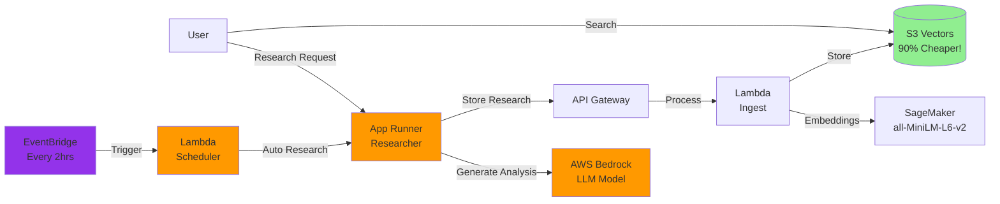

# 🧠 **Part 4 — Deploy the Researcher Agent**

In this branch, you will deploy the **Alex Researcher** service: an AI agent that generates investment research and automatically stores it in your knowledge base via the ingest pipeline.

The Researcher:

* Uses AWS Bedrock (Nova or OpenAI OSS 120B) for AI reasoning
* Uses the OpenAI Agents SDK for orchestration and tracing
* Calls your ingest API to store research in **S3 Vectors**
* Exposes a REST API via **App Runner**
* Can be run on-demand or on a schedule (every 2 hours)

## 📦 **Prerequisites**

Before starting, ensure you have:

1. Completed Parts 1–3:

   * IAM / Permissions
   * SageMaker Embedding Endpoint
   * S3 Vectors + Ingest Pipeline
2. Docker Desktop installed and running
3. AWS CLI configured with your IAM user credentials
4. Access to at least one supported Bedrock model (see Step 0)
5. Your `.env` file populated with values from previous branches

## 🏗️ **Architecture Overview**



# 🔁 **Step 0 — Configure Bedrock Model Access**

The Researcher uses AWS Bedrock with either:

* OpenAI OSS models (e.g. `openai.gpt-oss-120b-1:0`) in **us-west-2**, or
* Amazon Nova models (e.g. `us.amazon.nova-pro-v1:0`) in your region or `us-east-1`.

### 0.1 Request model access

1. Sign in to the AWS Console
2. Open **Amazon Bedrock**
3. Switch to **us-west-2** if using OSS models
4. In the left sidebar, select **Model access**
5. Click **Manage model access** / **Modify model access**
6. In the **OpenAI** section, request:

   * `gpt-oss-120b` (OpenAI GPT OSS 120B)
   * `gpt-oss-20b` (optional, smaller model)
7. Optionally, request **Amazon Nova** models in your region or `us-east-1` (e.g. `amazon.nova-pro-v1`)
8. Submit and wait for access (typically fast)

Notes:

* OSS models are only available in **us-west-2**
* No separate API key is needed for Bedrock; IAM roles handle auth
* The Researcher also uses an **OpenAI API key** for Agents SDK tracing (for observability)

### 0.2 Update `backend/researcher/server.py`

Open:

```text
backend/researcher/server.py
```

Find:

```python
    # Please override these variables with the region you are using
    # Other choices: us-west-2 (for OpenAI OSS models) and eu-central-1
    REGION = "us-east-1"
    os.environ["AWS_REGION_NAME"] = REGION  # LiteLLM's preferred variable
    os.environ["AWS_REGION"] = REGION       # Boto3 standard
    os.environ["AWS_DEFAULT_REGION"] = REGION  # Fallback

    # Please override this variable with the model you are using
    # Common choices: bedrock/eu.amazon.nova-pro-v1:0 for EU and bedrock/us.amazon.nova-pro-v1:0 for US
    # or bedrock/amazon.nova-pro-v1:0 if you are not using inference profiles
    # bedrock/openai.gpt-oss-120b-1:0 for OpenAI OSS models
    # bedrock/converse/us.anthropic.claude-sonnet-4-20250514-v1:0 for Claude Sonnet 4
    # NOTE that nova-pro is needed to support tools and MCP servers; nova-lite is not enough
    MODEL = "bedrock/us.amazon.nova-pro-v1:0"
    model = LitellmModel(model=MODEL)
```

Update:

* `REGION` to match where you have model access (e.g. `us-west-2` for OSS, `us-east-1` for Nova)
* `MODEL` to the exact Bedrock model ID you enabled (e.g. `bedrock/us.amazon.nova-pro-v1:0` or `bedrock/openai.gpt-oss-120b-1:0`).

Ensure you choose a model that supports **tools / MCP** (e.g. Nova Pro).

# 🪜 **Step 1 — Deploy ECR and IAM for the Researcher**

First, configure Terraform for this branch.

```bash
cd terraform/4_researcher
cp terraform.tfvars.example terraform.tfvars
```

Edit `terraform.tfvars`:

```hcl
aws_region       = "us-east-1"  # Your main AWS region
openai_api_key   = "sk-..."     # OpenAI API key for Agents SDK tracing
alex_api_endpoint = "https://xxxxxxxxxx.execute-api.us-east-1.amazonaws.com/prod/ingest"  # From Part 3
alex_api_key      = "your-api-key-here"                                                   # From Part 3
scheduler_enabled = false  # Keep false for now
```

Now deploy only the **ECR repository** and **App Runner IAM role**.

Mac / Linux:

```bash
terraform init

terraform apply \
  -target=aws_ecr_repository.researcher \
  -target=aws_iam_role.app_runner_role
```

Windows PowerShell:

```powershell
terraform init

terraform apply `
  -target="aws_ecr_repository.researcher" `
  -target="aws_iam_role.app_runner_role"
```

Confirm with `yes`.

Terraform creates:

* ECR repository for the Researcher Docker image
* IAM role for App Runner with required permissions

Record the **ECR repository URL** from the output; it will be used by the deploy script.

# 🚢 **Step 2 — Build and Deploy the Researcher Container**

Now build and push the Docker image, and trigger an App Runner deployment.

```bash
cd ../../backend/researcher
uv run deploy.py
```

The script will:

1. Build a Docker image (`--platform linux/amd64` for App Runner)
2. Push it to the ECR repository from Step 1
3. Trigger an App Runner deployment
4. Wait for the service to become healthy
5. Print the **App Runner service URL**

Example output:

```text
Service found at: https://xxxxxxxxxx.us-east-1.awsapprunner.com
Checking if service is healthy...
Service is healthy.
```

This **service URL** is what “`YOUR_SERVICE_URL`” refers to later in the README.

# 🏗️ **Step 3 — Create the App Runner Service (Terraform)**

After the image is built and pushed, return to Terraform to create the full service.

```bash
cd ../../terraform/4_researcher
terraform apply
```

Windows PowerShell:

```powershell
cd ..\..\terraform\4_researcher
terraform apply
```

Confirm with `yes`.

Terraform will:

* Create / update the App Runner service (using the ECR image)
* Configure environment variables (API endpoint, keys, model config)
* Optionally prepare the scheduler (depending on `scheduler_enabled`)

Initial App Runner deployment can take 3–5 minutes.
The final Terraform output will also include the **service URL**.

# 🔗 **Step 4 — Test the End-to-End Pipeline**

Now test the full path: **Research → Ingest → S3 Vectors → Search**.

### 4.1 Clean the vector store

```bash
cd ../../backend/ingest
uv run cleanup_s3vectors.py
```

Expected:

```text
✅ All documents deleted successfully
```

### 4.2 Generate research via the Researcher

```bash
cd ../researcher
uv run test_research.py
```

The script will:

1. Discover your App Runner service URL
2. Check the `/health` endpoint
3. Trigger a research job on a default topic
4. Send results to the ingest API
5. Print summary output

You can also pass a topic explicitly:

```bash
uv run test_research.py "Tesla competitive advantages"
uv run test_research.py "Microsoft cloud revenue growth"
```

### 4.3 Verify the research was stored

```bash
cd ../ingest
uv run test_search_s3vectors.py
```

You should see:

* Research documents
* Associated metadata (topic, timestamp)
* Evidence that embeddings were created and stored

### 4.4 Test semantic search

```bash
uv run test_search_s3vectors.py "electric vehicle market"
uv run test_search_s3vectors.py "inflation protection"
```

Even if the phrasing differs from the original topic, semantic search should surface related research.

# 🧪 **Step 5 — Test the Researcher Service Directly**

This step validates the **App Runner service** itself.

`YOUR_SERVICE_URL` here refers to the **App Runner service URL** printed by:

* `uv run test_research.py`
* or visible in the App Runner console

It will look like:

```text
https://xxxxxxxxxx.us-east-1.awsapprunner.com
```

### 5.1 Health check

Mac / Linux:

```bash
curl https://YOUR_APP_RUNNER_SERVICE_URL/health
```

Windows PowerShell:

```powershell
Invoke-WebRequest -Uri "https://YOUR_APP_RUNNER_SERVICE_URL/health" | ConvertFrom-Json
```

Example output:

```text
service         status  timestamp
-------         ------  ---------
Alex Researcher healthy 2025-12-07T13:11:27.830533+00:00
```

Or in JSON form:

```json
{
  "service": "Alex Researcher",
  "status": "healthy",
  "alex_api_configured": true,
  "timestamp": "2025-..."
}
```

### 5.2 Try additional research topics

From `backend/researcher`:

```bash
uv run test_research.py "NVIDIA AI chip market share"
uv run test_research.py "Apple services revenue growth"
uv run test_research.py "Gold vs Bitcoin as an inflation hedge"
```

Then query from `backend/ingest`:

```bash
uv run test_search_s3vectors.py "artificial intelligence"
uv run test_search_s3vectors.py "inflation hedge"
```

# ⏱️ **Step 6 — Enable Automated Research (Optional)**

The scheduler triggers the Researcher automatically every 2 hours.

### 6.1 Enable the scheduler

Edit `terraform/4_researcher/terraform.tfvars`:

```hcl
scheduler_enabled = true
```

Apply the change:

Mac / Linux:

```bash
cd terraform/4_researcher
terraform apply
```

Windows PowerShell:

```powershell
cd terraform\4_researcher
terraform apply
```

Confirm with `yes`.

Terraform will:

* Create a scheduler Lambda
* Create an EventBridge rule (every 2 hours)
* Wire the Lambda to call your App Runner `/research/auto` endpoint

Check status:

```bash
terraform output scheduler_status
```

### 6.2 Monitor automated research

Lambda scheduler logs:

```bash
aws logs tail /aws/lambda/alex-research-scheduler --follow --region us-east-1
```

App Runner application logs:

```bash
aws logs tail "/aws/apprunner/alex-researcher/*/application" --follow --region us-east-1
```

Search accumulated research:

```bash
cd ../../backend/ingest
uv run test_search_s3vectors.py
```

### 6.3 Disable the scheduler

When you want to stop automatic runs:

Mac / Linux:

```bash
cd terraform/4_researcher
terraform apply -var="scheduler_enabled=false"
```

Windows PowerShell:

```powershell
cd terraform\4_researcher
terraform apply -var="scheduler_enabled=false"
```

# 🧹 **Troubleshooting**

**Service creation failed**

* Check ECR repository:

  ```bash
  aws ecr describe-repositories
  ```

* Ensure Docker Desktop is running

* Verify AWS credentials (`aws sts get-caller-identity`)

**Deployment stuck in `OPERATION_IN_PROGRESS`**

* Normal for first deploy (5–10 minutes)
* Check App Runner logs in the AWS Console

**Exit code 255 / service will not start**

* Often due to architecture mismatch
* Ensure the deploy script builds for `linux/amd64`
* Re-run `uv run deploy.py`

**Connection refused / 5xx when calling service**

* Confirm service status is `RUNNING` in App Runner
* Verify you are using `https://` and the correct service URL

**504 Gateway Timeout**

* The agent may be performing long web browsing
* The request can time out but still complete and store results

**Bedrock model errors**

* Confirm model access in the Bedrock console
* Ensure IAM roles include Bedrock permissions
* Verify `REGION` and `MODEL` in `server.py`

# 🧽 **Clean Up (Optional)**

To remove all resources for this branch:

```bash
cd terraform/4_researcher
terraform destroy
```

This will delete:

* App Runner service
* ECR repository (if managed here)
* Scheduler Lambda and EventBridge rule
* IAM roles for the Researcher

# ✅ **Summary**

By completing this branch, you now have:

* A fully deployed **Researcher Agent** on AWS App Runner
* Integration with **Bedrock** for large-scale financial analysis
* Automatic storage of research into **S3 Vectors** via the ingest pipeline
* A tested end-to-end flow: Research → Ingest → Embeddings → Vectors → Search
* An optional **scheduler** to keep your knowledge base continuously updated
