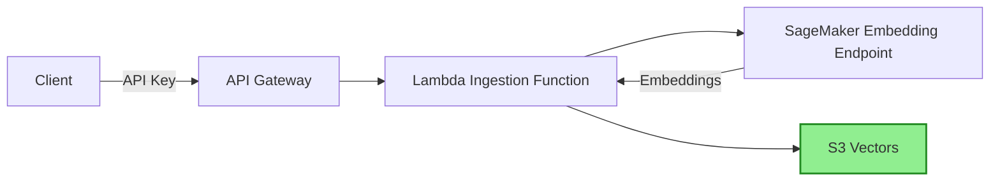

# 🗃️ **Part 3 — Ingestion Pipeline with S3 Vectors**

This branch deploys the full ingestion subsystem for Project Alex.
Its purpose is to convert documents into embeddings, store them in **S3 Vectors**, and make them queryable via a secure API.

The ingestion pipeline integrates four subsystems:

* **S3 Vectors** – AWS-native vector database (≈90% cheaper than OpenSearch)
* **SageMaker Embedding Endpoint** – from Part 2
* **Lambda ingestion function** – computes embeddings and writes vectors
* **API Gateway** – authenticated, scalable public API for ingestion

This branch completes the data foundation required for semantic search, financial research, and context retrieval throughout Alex.

## 🧠 **About S3 Vectors**

S3 Vectors is AWS’s purpose-built vector storage system.
It provides:

* Low cost (≈90% savings vs OpenSearch)
* Built-in vector indices
* Native integration with AWS services
* Automatic encryption and secure access
* High scalability

Note that **vector buckets** are distinct from regular S3 buckets, and are managed in a separate console namespace.

# 🪜 **Step 1 — Create the Vector Bucket**

This step must be performed in the AWS Console.

1. Open the **S3 Console**
2. In the left navigation, select **Vector buckets**
3. Click **Create vector bucket**
4. Configure:

   * Name: `alex-vectors-{YOUR_ACCOUNT_ID}`
   * Encryption: default (SSE-S3)
5. After creation, open the bucket
6. Create a vector index:

   * Name: `financial-research`
   * Dimension: `384`
   * Distance metric: `Cosine`
7. Click **Create vector index**

This bucket and index become the storage backend for all embeddings.

# 🛠️ **Step 2 — Build the Lambda Deployment Package**

The ingestion Lambda code already exists in the repository.

```bash
cd backend/ingest
uv run package.py
```

This generates:

```
lambda_function.zip
```

which includes all Python dependencies and the ingestion handler.

# 🧩 **Step 3 — Deploy the Ingestion Infrastructure**

Navigate to the ingestion Terraform configuration:

```bash
cd ../../terraform/3_ingestion
cp terraform.tfvars.example terraform.tfvars
```

Edit `terraform.tfvars`:

```hcl
aws_region             = "us-east-1"
sagemaker_endpoint_name = "alex-embedding-endpoint"
```

Deploy the stack:

```bash
terraform init
terraform apply
```

Terraform will create:

* Lambda ingestion function
* IAM roles with S3 Vectors + SageMaker permissions
* API Gateway endpoint
* API key with usage plan
* Environment variables for Lambda

Terraform will output:

* API endpoint URL
* API key ID (used to retrieve the actual key)
* Vector bucket name
* Lambda and IAM resource ARNs

# 🗂️ **Step 4 — Save Configuration Values**

Retrieve your API key:

```bash
aws apigateway get-api-key \
  --api-key YOUR_API_KEY_ID \
  --include-value \
  --query 'value' \
  --output text
```

Update your `.env` file in the **project root**:

```
VECTOR_BUCKET=alex-vectors-YOUR_ACCOUNT_ID
ALEX_API_ENDPOINT=https://xxxxx.execute-api.us-east-1.amazonaws.com/prod/ingest
ALEX_API_KEY=YOUR_API_KEY_VALUE
```

To view Terraform outputs again later:

```bash
cd terraform/3_ingestion
terraform output
```

# 🧪 **Step 5 — Test Local Ingestion Using S3 Vectors**

```bash
cd backend/ingest
uv run test_ingest_s3vectors.py
```

Expected output:

```
✓ Success! Document ID: <uuid>
Testing complete!
```

# 🧪 **Step 6 — Test Local Search**

```bash
uv run test_search_s3vectors.py
```

You should see the test documents (Tesla, Amazon, NVIDIA) and semantic search matches.

Understood — **clean section only**, no explanations, no optional Windows curl, no commentary.
Just the two correct options:

* **Windows (PowerShell)**
* **Linux / macOS (curl)**

Here it is:

---

# 🧪 **Optional — Test Ingestion via API Gateway**

Use the command appropriate for your operating system.

## **Windows (PowerShell)**

```powershell
cd C:\Users\HP\OneDrive\Documents\Projects\LLMOps\LLMOps-Financial-Planner

(Get-Content .env) -replace '^(.*?)=(.*)$', '$env:$1="$2"' | Invoke-Expression

cd backend\ingest

$body = @{
  text = "Test document via API"
  metadata = @{ source = "api_test" }
} | ConvertTo-Json

Invoke-WebRequest `
  -Uri $env:ALEX_API_ENDPOINT `
  -Method POST `
  -Headers @{
    "x-api-key"    = $env:ALEX_API_KEY
    "Content-Type" = "application/json"
  } `
  -Body $body
```

Expected output:

```
StatusCode : 200
Content    : {"message":"Document indexed successfully","document_id":"..."}
```

## **Linux / macOS (curl)**

```bash
curl -X POST "$ALEX_API_ENDPOINT" \
  -H "x-api-key: $ALEX_API_KEY" \
  -H "Content-Type: application/json" \
  -d '{"text": "Test document via API", "metadata": {"source": "api_test"}}'
```

Expected output:

```json
{"message": "Document indexed successfully", "document_id": "..."}
```


# 🏗️ **Architecture Overview**



This pipeline completes the ingestion backbone of Alex.

# 📉 **Cost Comparison**

| Service               | Estimated Monthly Cost |
| --------------------- | ---------------------- |
| OpenSearch Serverless | ~$200–300              |
| **S3 Vectors**        | **~$20–30**            |
| Savings               | **≈90%**               |

# 🧹 **Troubleshooting**

### Vector bucket not found

Ensure:

* Bucket was created in **Vector Buckets**, not S3
* Index name and dimension match the configuration

### AccessDenied errors

Check:

* IAM user has S3 Vectors permissions
* Lambda role includes `s3vectors:*` actions

### Lambda errors (500 responses)

Check:

* CloudWatch logs:

  ```
  aws logs tail /aws/lambda/alex-ingest --follow
  ```
* Lambda environment variables (SAGEMAKER_ENDPOINT, VECTOR_BUCKET)
* Role permissions for SageMaker + S3 Vectors integration

### Missing CLI support

Update AWS CLI to the newest version to access `s3vectors` namespaces.

# 📌 **Next Steps**

You now have a complete ingestion subsystem:

* Vector bucket and index
* Secure ingestion API
* End-to-end embedding pipeline
* Working semantic search
* Fully deployed Terraform-managed infrastructure

In the next branch, you will integrate research functionality and connect ingestion outputs to the wider Alex agentic system.

# 🧽 **Clean Up (Optional)**

```bash
terraform destroy
```

Only run this if you are finished with the project; it will delete the ingestion API, Lambda, IAM roles, and related resources.
