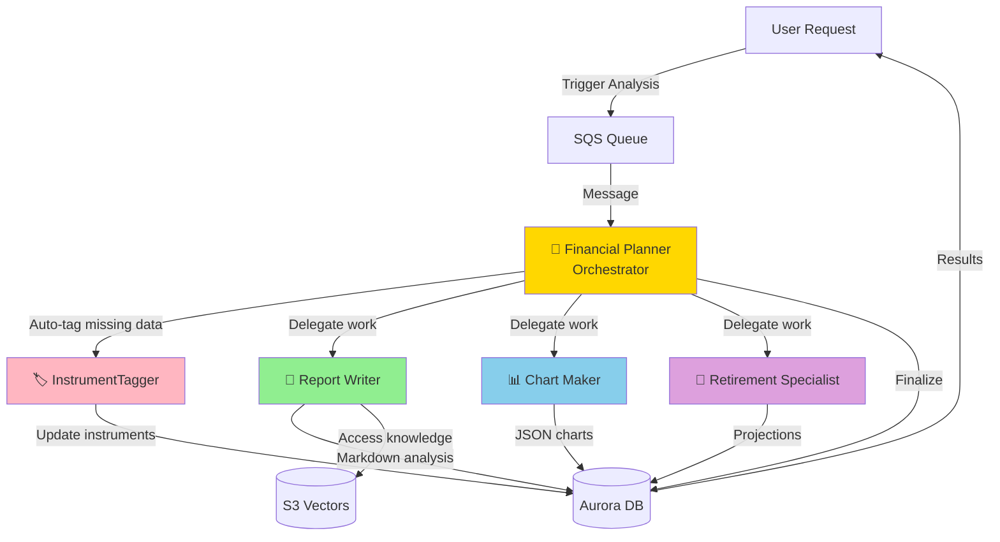

# 🎭 **Part 6 — AI Agent Orchestra**

In this branch, you give Alex a **full multi-agent AI backend**: five specialised Lambda agents orchestrated via SQS, Aurora, Bedrock, and S3 Vectors. This is where Alex stops being a single “smart endpoint” and becomes a **coordinated team of experts** working together on each user’s portfolio.

By the end of this branch you will have:

* Five production-ready Lambda agents (Planner, Tagger, Reporter, Charter, Retirement)
* A robust SQS-driven orchestration flow
* Local and remote (AWS) test harnesses
* Terraform wiring for all agent infrastructure and configuration

## 🎻 **Why a Multi-Agent Architecture?**

Instead of one giant prompt that does everything badly, Alex uses **specialised agents**, each tuned for a narrow responsibility:

* **Planner (Orchestrator)** – decides *what* needs doing and *who* should do it
* **Tagger** – classifies instruments and fills in missing allocation data
* **Reporter** – writes long-form markdown portfolio analysis
* **Charter** – generates structured JSON chart specs for the frontend
* **Retirement** – runs Monte Carlo retirement simulations and projections

Advantages:

1. **Specialisation** – each agent is optimised for one job (classification, reporting, charts, retirement)
2. **Reliability** – focused prompts and tools are easier to control and evaluate
3. **Parallel execution** – agents can work concurrently where possible
4. **Maintainability** – you can iterate on one agent’s prompts/tools without touching others
5. **Cost control** – you only invoke the agents relevant to a given request

For a deeper conceptual background, see Philipp Schmid’s article on context engineering:

[https://www.philschmid.de/context-engineering](https://www.philschmid.de/context-engineering)

## 🧱 **What This Branch Builds**

This branch deploys and wires up:

* ✅ Five Lambda agents:

  * `alex-planner`
  * `alex-tagger`
  * `alex-reporter`
  * `alex-charter`
  * `alex-retirement`
* ✅ An SQS queue + DLQ for orchestrating analysis jobs
* ✅ A complete **agent test harness** (local and AWS)
* ✅ Docker-based packaging for Lambda-ready ZIPs
* ✅ Terraform module for all agent infrastructure (IAM, triggers, logs, S3 code bucket)
* ✅ Bedrock + Polygon configuration for real-time analysis

High-level architecture:



**Pre-requisites from earlier parts**

You should already have:

* Aurora Serverless v2 database (Part 5)
* S3 Vectors + embeddings endpoint (Parts 2–3)
* Basic backend environment and `.env` in place


# 🧩 **Step 1 — Configure Agent Environment & Polygon**

The AI agents depend on both **Bedrock** and **Polygon.io** for LLM calls and price data.

### 1.1 Get a free Polygon API key

The Planner agent fetches real-time or end-of-day prices via **Polygon.io**.

1. Visit [https://polygon.io](https://polygon.io)
2. Click **Get your Free API Key**
3. Sign up and verify your email
4. Copy your API key from the dashboard

The free tier includes:

* 5 API calls per minute
* End-of-day price data
* Perfect for development and testing

For serious / production use, you can upgrade later to a paid plan.

### 1.2 Update `.env` with agent configuration

In your project `.env`, add:

```bash
# Part 6 - Agent Configuration
BEDROCK_MODEL_ID=us.amazon.nova-pro-v1:0
BEDROCK_REGION=us-west-2
DEFAULT_AWS_REGION=us-east-1  # Or your preferred region

# Polygon.io API for stock prices
POLYGON_API_KEY=your_polygon_api_key_here
POLYGON_PLAN=free   # or "paid" if you upgrade later
```

Nova Pro is used as the primary LLM for tool-calling and orchestration.

Ensure your local tooling (`uv`, test scripts) is loading this `.env` (for example via `python-dotenv`).


# 🧠 **Step 2 — Explore the Agent Code**

Before deploying, familiarise yourself with each agent’s responsibilities.

### 2.1 InstrumentTagger – classification agent

**Directory**: `backend/tagger`

Key files:

* `agent.py` – the Tagger agent implementation
* `templates.py` – LLM prompt + structured output definition
* `lambda_handler.py` – Lambda entrypoint

The Tagger:

* Classifies instruments (ETFs, stocks, bond funds, etc.)
* Infers **asset class allocation** (equity, fixed income, real estate, commodities)
* Infers **geographic exposure**
* Uses **structured outputs** (Pydantic schema)
* Does *not* need external tools – pure classification prompt

### 2.2 Reporter – portfolio analysis writer

**Directory**: `backend/reporter`

Key files:

* `agent.py` – Reporter agent logic
* `templates.py` – analytical framework prompt
* `lambda_handler.py` – Lambda entrypoint

The Reporter:

* Generates a comprehensive markdown portfolio analysis
* Uses tools to:

  * Access S3 Vectors (market context, knowledge)
  * Write results back to Aurora (into `jobs.report_payload`)
* Produces:

  * Executive summary
  * Key observations / strengths / weaknesses
  * Recommendations and next steps

### 2.3 Charter – chart-generation engine

**Directory**: `backend/charter`

Key files:

* `agent.py` – Chart Maker agent
* `templates.py` – visualisation guidelines and constraints
* `lambda_handler.py` – Lambda entrypoint

The Charter:

* Produces **4–6 charts** per analysis
* Chooses chart types (pie, bar, donut, etc.)
* Returns **Recharts-compatible JSON** only (no free-text)
* Does not use tools – it reads data from the DB via the orchestrator and emits JSON chart specs

### 2.4 Retirement – Monte Carlo specialist

**Directory**: `backend/retirement`

Key files:

* `agent.py` – Retirement analyst
* `templates.py` – retirement planning and simulation prompt
* `lambda_handler.py` – Lambda entrypoint

The Retirement agent:

* Runs Monte Carlo simulations for retirement outcomes
* Estimates probabilities of success / failure
* Produces a detailed explanation and suggested levers (save more, work longer, change allocation, etc.)
* Uses tools to write projections into `jobs.retirement_payload`

### 2.5 Planner – orchestrator / conductor

**Directory**: `backend/planner`

Key files:

* `agent.py` – Planner agent logic
* `templates.py` – orchestration strategy / decision logic
* `lambda_handler.py` – Lambda entrypoint for SQS-triggered jobs

The Planner:

* Listens for **SQS messages** containing job IDs
* Ensures instruments are tagged (invokes Tagger when necessary)
* Delegates to Reporter, Charter, and Retirement as needed
* Coordinates parallel execution where possible
* Finalises the job record (status, summary, completion time)


# 🧪 **Step 3 — Test Agents Locally (Mocked)**

Each agent has a **local smoke test** that runs entirely on your machine, using your `.env` and mocked infrastructure where appropriate.

> These tests run the agent logic directly (or its Lambda handler) without going through AWS Lambda / SQS.

### 3.1 Tagger – local smoke test

**From** `backend/tagger`:

```bash
uv run test_simple.py
```

Expected output (example):

* Uses VTI (or similar) as a test instrument
* Shows something like:

  * `Tagged: 1 instruments`
  * `Updated: ['VTI']`

Run time: ~5–10 seconds.

### 3.2 Reporter – local smoke test

**From** `backend/reporter`:

```bash
uv run test_simple.py
```

Expected:

* `Success: 1`
* `Message: Report generated and stored`
* Report body is long markdown (≈ 2,800+ characters) with:

  * Executive summary
  * Key observations
  * Risks & recommendations

Run time: ~15–20 seconds.

### 3.3 Charter – local smoke test

**From** `backend/charter`:

```bash
uv run test_simple.py
```

Expected:

* `Success: True`
* `Message: Generated 5 charts`
* Output includes:

  * Chart titles
  * Types (`"pie"`, `"bar"`, `"donut"`, etc.)
  * Recharts-style data arrays with colours

Run time: ~10–15 seconds.

### 3.4 Retirement – local smoke test

**From** `backend/retirement`:

```bash
uv run test_simple.py
```

Expected:

* `Success: 1`
* `Message: Retirement analysis completed`
* Body describes:

  * Monte Carlo simulation summary
  * Probability of success
  * Scenario ranges (pessimistic / base / optimistic)
  * Concrete improvement suggestions

Run time: ~10–15 seconds.

### 3.5 Planner – local smoke test

**From** `backend/planner`:

```bash
uv run test_simple.py
```

This script:

* Ensures test data exists (calling `reset_db.py --with-test-data --skip-drop`)
* Creates a `portfolio_analysis` job
* Invokes `lambda_handler` with `MOCK_LAMBDAS=true`

Expected:

* `Status Code: 200`
* `Success: True`
* `Message: Analysis completed for job <job-id>`

Run time: ~5–10 seconds.

### 3.6 Full backend local smoke test

**From** `backend`:

```bash
uv run test_simple.py
```

This runs local smoke tests for all agents and prints a summary, e.g.:

```text
Tagger:   ✅
Reporter: ✅
Charter:  ✅
Retirement: ✅
Planner: ✅

✅ ALL TESTS PASSED!
```

Run time: ~60–90 seconds overall.


# 📦 **Step 4 — Package Lambda Functions with Docker**

To ensure binary compatibility with the Lambda runtime, dependencies are packaged inside Docker.

**From** `backend`:

```bash
uv run package_docker.py
```

This script:

1. Uses the official Lambda Python image
2. Installs dependencies into a `/package` directory
3. Bundles each agent’s code + dependencies into a ZIP
4. Produces one ZIP per Lambda agent

Expected output (example):

```text
Packaging tagger...
✅ Created tagger_lambda.zip (≈52 MB)

Packaging reporter...
✅ Created reporter_lambda.zip (≈68 MB)

Packaging charter...
✅ Created charter_lambda.zip (≈54 MB)

Packaging retirement...
✅ Created retirement_lambda.zip (≈55 MB)

Packaging planner...
✅ Created planner_lambda.zip (≈72 MB)

All agents packaged successfully!
```

These ZIPs are then uploaded to an S3 code bucket and used by Terraform / deployment scripts.


# 🌍 **Step 5 — Configure Terraform for Agent Infrastructure**

Terraform in `terraform/6_agents` manages all agent-related infrastructure: Lambdas, SQS, IAM, logs, and S3 code bucket.

### 5.1 Create and edit `terraform.tfvars`

**From project root**:

```bash
cd terraform/6_agents
cp terraform.tfvars.example terraform.tfvars
```

Open `terraform.tfvars` and adjust:

```hcl
# Your AWS region for Lambda functions (typically your main region)
aws_region = "us-east-1"

# Aurora cluster ARN from Part 5 (can be left empty; data sources will resolve)
aurora_cluster_arn = ""

# Aurora secret ARN from Part 5 (can be left empty; data sources will resolve)
aurora_secret_arn = ""

# S3 Vectors bucket name from Part 3
vector_bucket = "alex-vectors-123456789012"  # Replace with your actual bucket

# Bedrock model configuration
bedrock_model_id = "amazon.nova-pro-v1:0"
bedrock_region   = "us-east-1"

# SageMaker endpoint name from Part 2
sagemaker_endpoint = "alex-embedding-endpoint"

# Polygon API configuration
polygon_api_key = "your_polygon_api_key_here"
polygon_plan    = "free"
```

Notes:

* `aurora_cluster_arn` and `aurora_secret_arn` can be left blank – the module uses Terraform data sources to look them up based on naming.
* Ensure `vector_bucket`, `sagemaker_endpoint`, and `polygon_api_key` match your actual values.


# 🚀 **Step 6 — Deploy Agent Infrastructure with Terraform**

### 6.1 Initialise Terraform

From `terraform/6_agents`:

```bash
terraform init
```

### 6.2 Review Terraform plan

```bash
terraform plan
```

You should see planned creation of:

* 5 Lambda functions (`alex-planner`, `alex-tagger`, `alex-reporter`, `alex-charter`, `alex-retirement`)
* SQS queue + dead letter queue
* IAM roles and policies for each agent
* S3 bucket for code artefacts
* CloudWatch log groups

### 6.3 Apply the changes

```bash
terraform apply
```

Confirm with `yes`.

Typical completion message:

```text
Apply complete! Resources: 25 added, 0 changed, 0 destroyed.

Outputs:
lambda_functions = {
  "charter"   = "alex-charter"
  "planner"   = "alex-planner"
  "reporter"  = "alex-reporter"
  "retirement"= "alex-retirement"
  "tagger"    = "alex-tagger"
}
sqs_queue_url = "https://sqs.us-east-1.amazonaws.com/123456789012/alex-analysis-jobs"
```

At this point the **infrastructure** exists, but the code still needs to be pushed from your freshly built ZIPs.


# 📤 **Step 7 — Deploy Lambda Code Updates**

After packaging, deploy the ZIPs to the live Lambda functions.

**From** `backend`:

```bash
uv run deploy_all_lambdas.py
```

This script uploads the ZIPs (e.g. `planner_lambda.zip`, `tagger_lambda.zip`, etc.) to S3 and updates the corresponding Lambda functions.

Expected output:

```text
Updating alex-tagger... ✅
Updating alex-reporter... ✅
Updating alex-charter... ✅
Updating alex-retirement... ✅
Updating alex-planner... ✅

All Lambda functions updated successfully!
```

Now your AWS Lambdas are running the same code you tested locally.


# ☁️ **Step 8 — Test Deployed Agents in AWS**

Each agent has a **full remote test** that exercises its Lambda via AWS (and any configured tools).

### 8.1 Tagger – full remote test

**From** `backend/tagger`:

```bash
uv run test_full.py
```

Run this 2–3 times; it should consistently succeed.

### 8.2 Reporter – full remote test

**From** `backend/reporter`:

```bash
uv run test_full.py
```

Verifies:

* Lambda invocation
* S3 Vectors access
* DB writes into `jobs.report_payload`

### 8.3 Charter – full remote test

**From** `backend/charter`:

```bash
uv run test_full.py
```

Ensures chart JSON is generated and persisted correctly.

### 8.4 Retirement – full remote test

**From** `backend/retirement`:

```bash
uv run test_full.py
```

Checks Monte Carlo projections run successfully and results are stored.

### 8.5 Planner – full remote test

**From** `backend/planner`:

```bash
uv run test_full.py
```

This is the most involved test:

* Creates a job
* Triggers Planner
* Planner coordinates Tagger / Reporter / Charter / Retirement
* Job is updated as completed in Aurora

It may take **60–90 seconds** on the first run.

### 8.6 Full system test via SQS

**From** `backend`:

```bash
uv run test_full.py
```

This:

1. Creates a new `jobs` row
2. Sends a message to the **SQS** queue
3. Lets the Planner Lambda consume and orchestrate the whole pipeline
4. Waits for completion and verifies results

End result: a fully end-to-end test of the distributed system.


# 📈 **Step 9 — Advanced Scenario Tests**

### 9.1 Multiple accounts per user

**From** `backend`:

```bash
uv run test_multiple_accounts.py
```

This creates a user with multiple accounts (e.g. 401k, IRA, Taxable) and runs a full analysis. It verifies:

* Correct aggregation across accounts
* Proper handling of different wrappers and cash balances

### 9.2 Scale / concurrency test

**From** `backend`:

```bash
uv run test_scale.py
```

This:

* Creates several users with varying portfolio sizes
* Dispatches multiple jobs concurrently
* Validates that the system can handle parallel workloads using SQS + Lambda concurrency

Use this to get a feel for how the system behaves under moderate load.


# 🗄️ **Step 10 — Inspect Jobs and Results in the Database**

Once remote tests pass, inspect what the agents actually wrote to Aurora.

**From** `backend`:

```bash
uv run check_jobs.py
```

This script prints recent jobs, including:

* Job ID and timestamps
* User information
* Status (`pending`, `processing`, `completed`, `error`)
* Sizes of each payload (`report_payload`, `charts_payload`, `retirement_payload`, `summary_payload`)

This is a convenient way to confirm that all agents are writing into the `jobs` table as expected.


# 📊 **Step 11 — Explore AWS Console & Monitoring**

### 11.1 Lambda functions

1. Open the **Lambda Console**
2. Locate:

   * `alex-planner`
   * `alex-tagger`
   * `alex-reporter`
   * `alex-charter`
   * `alex-retirement`
3. Click into `alex-planner`
4. Open the **Monitor** tab → **View logs in CloudWatch**
5. Inspect the latest log stream for detailed execution traces and agent reasoning logs

### 11.2 SQS queue

1. Open the **SQS Console**
2. Select `alex-analysis-jobs`
3. Check:

   * **Messages available** – should be 0 when idle
   * **Monitoring** tab – for throughput and error metrics
4. Inspect the DLQ (`alex-analysis-jobs-dlq`) – ideally empty

### 11.3 Cost management

1. Open **Cost Management → Cost Explorer**
2. Filter by service:

   * Lambda
   * Aurora
   * Bedrock
   * SQS
3. Estimate a monthly development cost; typical ranges:

   * Aurora baseline (depending on ACUs)
   * Lambda invocations (very cheap at low volume)
   * Bedrock tokens (main variable cost)
   * SQS (fractions of a cent at low usage)


# 🧯 **Troubleshooting & Deep-Dive Notes**

### Agent timeouts

If an agent times out:

1. Check each Lambda’s timeout (agents ≈ 60s, Planner ≈ 300s)
2. Verify Bedrock permissions and model access in the configured region
3. Inspect CloudWatch logs for stack traces or retry behaviour

### Database connection errors

1. Confirm the Aurora cluster is **available** (not paused)
2. Check `AURORA_CLUSTER_ARN` / `AURORA_SECRET_ARN` in Lambda environment variables
3. Ensure RDS Data API IAM permissions are present for the Lambda role

### SQS messages not being processed

1. Confirm that `alex-planner` has an SQS trigger bound to the queue
2. Check Lambda’s IAM policy for SQS `ReceiveMessage/DeleteMessage`
3. Inspect the DLQ for failed messages

### Rate limiting (LLM / Polygon)

1. Logs may show TooManyRequests / rate-limit messages
2. The code includes retry with exponential backoff, but bursts can still fail
3. For heavy testing, slow down or consider higher-tier plans

### Model / region errors

If you see “model not found” or similar:

1. Confirm `BEDROCK_MODEL_ID` and `BEDROCK_REGION` in `.env` and Lambda env
2. Ensure the model (e.g. `amazon.nova-pro-v1:0`) is enabled in the selected region


# ✅ **Summary**

In this branch you:

* ✅ Configured environment variables for **Bedrock** and **Polygon**
* ✅ Explored five specialised agents and their prompts
* ✅ Ran **local smoke tests** for each agent and the planner
* ✅ Packaged all Lambda functions using a Docker-based build
* ✅ Deployed full **agent infrastructure** with Terraform
* ✅ Deployed updated Lambda code ZIPs
* ✅ Validated remote execution via **test_full** scripts and SQS
* ✅ Explored jobs, logs, and costs in AWS

Your **AI Agent Orchestra** is now fully live – Planner, Tagger, Reporter, Charter, and Retirement are all working together to analyse portfolios, generate reports, create charts, and model retirement outcomes.
