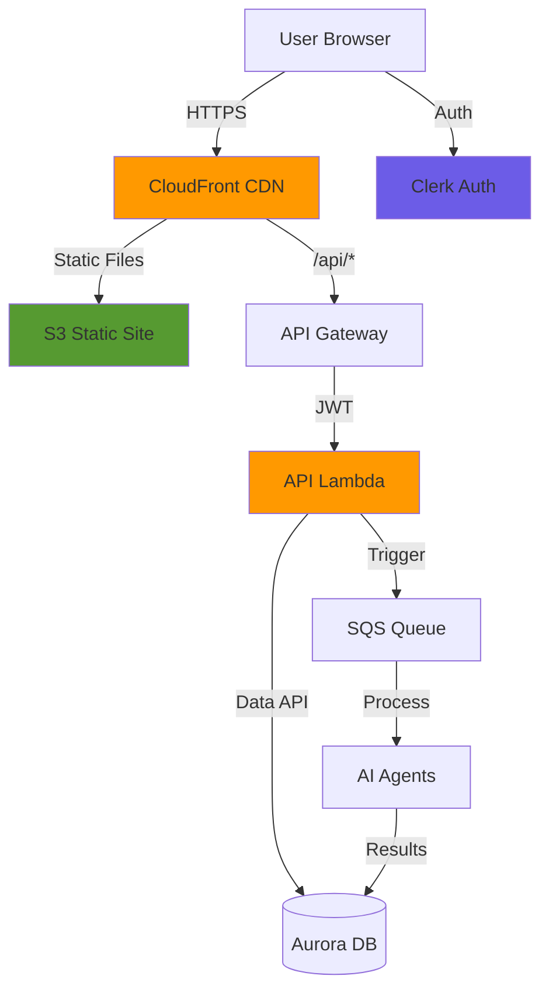

# 🖥️ **Part 7 — Frontend & API**

In this branch, you deploy the **user interface and HTTP API** that bring Alex to life: a modern React (Next.js) frontend plus a FastAPI backend running on Lambda and API Gateway.

By the end of this branch, you will have a **full SaaS experience**:

* Clerk-based authentication and automatic user creation
* Portfolio management (accounts, positions, cash)
* Real-time multi-agent analysis triggering and status checks
* Interactive reports, charts, and retirement projections
* Production-grade infrastructure: CloudFront, S3 static hosting, API Gateway, Lambda

## 🌐 **What This Branch Builds**

This branch wires up:

* ✅ Next.js frontend with TailwindCSS and Clerk authentication
* ✅ FastAPI backend deployed as `alex-api` Lambda behind API Gateway
* ✅ Local dev harness for running frontend + API together
* ✅ Production S3 + CloudFront static site hosting
* ✅ JWT-secured API integrated with the existing Aurora + SQS + agents stack

Architecture overview:



Pre-requisites:

* Database, SQS, agents, and vectors deployed in earlier parts
* `.env` set up for Aurora, Bedrock, SQS, etc.


# 🔐 **Step 1 — Configure Clerk Authentication**

You’ll use **Clerk** for authentication (same provider as earlier projects). You can reuse an existing Clerk app or create a new one.

### 1.1 Get your Clerk credentials

If you already have a Clerk app:

1. Sign in at [https://dashboard.clerk.com](https://dashboard.clerk.com)
2. Select your existing application
3. Go to **API Keys**
4. Note:

   * **Publishable Key** (starts with `pk_`)
   * **Secret Key** (starts with `sk_`)
5. In the same area, open **Show JWT Public Key** → copy:

   * **JWKS Endpoint URL** (JWKS)

If you need a new app:

1. Sign up at [https://clerk.com](https://clerk.com)
2. Create a new application
3. Choose **Email** (and optionally Google) as sign-in methods
4. Grab your publishable + secret keys from **API Keys**

### 1.2 Configure frontend environment

Create `.env.local` in the `frontend` directory:

```bash
# Clerk Authentication (use your own keys)
NEXT_PUBLIC_CLERK_PUBLISHABLE_KEY=pk_test_your-key-here
CLERK_SECRET_KEY=sk_test_your-secret-here

# Sign-in/up redirects (these paths are wired into the app)
NEXT_PUBLIC_CLERK_AFTER_SIGN_IN_URL=/dashboard
NEXT_PUBLIC_CLERK_AFTER_SIGN_UP_URL=/dashboard

# API URL - localhost for dev, API Gateway URL for prod
NEXT_PUBLIC_API_URL=http://localhost:8000
```

For production you’ll later change `NEXT_PUBLIC_API_URL` to your API Gateway base URL.

### 1.3 Configure backend environment for JWT validation

In your **root** `.env` file, add:

```bash
# Part 7 - Clerk Authentication
CLERK_JWKS_URL=https://your-app.clerk.accounts.dev/.well-known/jwks.json
```

To find it:

1. Clerk Dashboard → **API Keys**
2. Click **Show JWT Public Key**
3. Copy the **JWKS Endpoint** URL

Later, Terraform will also need the JWKS URL and issuer.


# 🧪 **Step 2 — Run Frontend & API Locally**

Before deploying to AWS, verify that the full stack works locally.

### 2.1 Install frontend dependencies

From the project root:

```bash
cd frontend
npm install
```

This installs React, Next.js, Tailwind, Clerk, etc.

### 2.2 Start local backend + frontend

Use the helper script that runs both FastAPI and Next.js together.

From the `scripts` directory:

```bash
cd ../scripts   # if you are in frontend
uv run run_local.py
```

Expected output:

```text
🚀 Starting FastAPI backend...
  ✅ Backend running at http://localhost:8000
     API docs: http://localhost:8000/docs

🚀 Starting NextJS frontend...
  ✅ Frontend running at http://localhost:3000
```

### 2.3 Explore the local app

Open [http://localhost:3000](http://localhost:3000):

1. **Landing page** – Alex AI Financial Advisor homepage
2. **Sign in** – click “Sign In”, use your Clerk account or create one
3. **Dashboard** – after sign-in you’re redirected to `/dashboard`
4. The backend automatically **creates your user record** in Aurora (via `GET /api/user` on first visit)

### 2.4 Inspect the API documentation

Open [http://localhost:8000/docs](http://localhost:8000/docs).

You’ll see FastAPI’s Swagger UI:

* Available endpoints
* Request/response schemas
* Auth requirements
* Try-it-out UI (you will need a valid JWT)

Key API routes include:

* `GET /api/user` – get or create logged-in user
* `GET /api/accounts` – list accounts for the current user
* `POST /api/positions` – create/update positions
* `POST /api/analyze` – trigger AI analysis (Planner + agents)
* `GET /api/jobs/{job_id}` – fetch job status and results


# 💼 **Step 3 — Populate a Test Portfolio**

To make the UI and agents interesting, you’ll create some sample accounts and positions.

### 3.1 Use the Accounts page

In the frontend:

1. Click **Accounts** in the navigation
2. Initially, you’ll see “No accounts found”
3. Click **Populate Test Data**

The system will create:

* 3 accounts:

  * 401k
  * Roth IRA
  * Taxable brokerage
* A spread of ETF/stock positions
* Cash balances per account

### 3.2 Explore account & position management

Click an account to:

* View positions with current values
* Edit quantities
* Add new positions (by ticker)
* Delete positions
* Update cash balances

Example flow:

1. Click the edit icon next to a position
2. Change the quantity
3. Save
4. Confirm the total value updates

> Note: **AI analysis won’t run end-to-end** until the AWS infra (SQS, agents, Lambda API) is deployed and correctly wired. Local portfolio management will still work.


# ☁️ **Step 4 — Deploy API & Frontend Infrastructure with Terraform**

Now you’ll deploy the **API Gateway + Lambda API** and **CloudFront + S3 frontend hosting**.

### 4.1 Configure Terraform variables

**From** `backend/reporter`:

```bash
cd terraform/7_frontend
cp terraform.tfvars.example terraform.tfvars
```

Expected:

```hcl
# AWS region for frontend + API
aws_region = "us-east-1"

# Clerk configuration for JWT validation
# Use values from your Clerk dashboard
clerk_jwks_url = "https://your-instance.clerk.accounts.dev/.well-known/jwks.json"
clerk_issuer   = "https://your-instance.clerk.accounts.dev"
```

To find your AWS account ID (used in some bucket names and outputs):

```bash
aws sts get-caller-identity --query Account --output text
```

### 4.2 Package the API Lambda

From the project root:

```bash
cd backend/api
uv run package_docker.py
```

This builds a Lambda-compatible ZIP (e.g. `api_lambda.zip`) inside the `backend/api` folder.

### 4.3 Deploy frontend & API infrastructure

From `terraform/7_frontend`:

```bash
terraform init
terraform plan
terraform apply
```

Expected:

* `Success: 1`
* `Message: Retirement analysis completed`
* Body describes:

* S3 bucket for static frontend files
* CloudFront distribution for global delivery
* API Gateway REST API (or HTTP API) for `/api/*` routes
* `alex-api` Lambda for FastAPI backend
* IAM roles/policies and log groups

Provisioning typically takes **10–15 minutes** (CloudFront takes the longest).

### 4.4 Capture Terraform outputs and update `.env`

After apply:

```bash
uv run test_simple.py
```

You should see values like:

* `cloudfront_url` – frontend URL
* `api_gateway_url` – production API base URL
* `s3_bucket` – static site bucket

You must also ensure your `.env` has the **SQS queue URL** from Part 6:

From `terraform/6_agents`:

```bash
terraform output sqs_queue_url
```

Then in your root `.env`:

```bash
SQS_QUEUE_URL=https://sqs.us-east-1.amazonaws.com/123456789012/alex-analysis-jobs
```

For production, update `NEXT_PUBLIC_API_URL` in `frontend/.env.local` to your `api_gateway_url`.


# 📦 **Step 5 — Build & Deploy the Frontend**

With the infrastructure in place, you can now ship the Next.js frontend to S3 + CloudFront.

### 5.1 Build the production frontend

From `frontend`:

```bash
npm run build
```

This generates an optimised static export (e.g. `out/` / `.next` depending on deployment pattern specified in the repo).

### 5.2 Deploy to S3 + invalidate CloudFront

From `scripts`:

```bash
cd ../scripts
uv run deploy.py
```

The deployment script:

1. Uploads the built frontend assets to the S3 bucket created by Terraform
2. Applies correct content types and cache headers
3. Invalidates the CloudFront cache so new versions show up immediately

Typical duration: **1–2 minutes** after the build is done.


# 🌍 **Step 6 — Test the Production Deployment**

### 6.1 Open your CloudFront URL

Use the `cloudfront_url` output from Terraform, for example:

```text
https://d1234567890abcdef.cloudfront.net
```

1. **Sign in** with your Clerk account
2. Confirm that the **dashboard** loads
3. Check that **API-based data** appears (accounts, user profile)

If API calls fail, double-check `NEXT_PUBLIC_API_URL` in `.env.local` and redeploy the frontend.

### 6.2 Verify portfolio management in production

1. Go to **Accounts**
2. Click **Populate Test Data** if needed
3. Edit an existing position and save
4. Add a new position to an account

All changes should be persisted in **Aurora through the `alex-api` Lambda**.


# 🤖 **Step 7 — Run AI Analysis in Production**

Now that the full stack is live, you can run a real multi-agent analysis from the UI.

### 7.1 Open the Advisor Team page

In the frontend, navigate to **Advisor Team**. You’ll see four visible agents:

* 🎯 **Financial Planner** – orchestrates the workflow
* 📊 **Portfolio Analyst** – detailed portfolio analysis (Reporter)
* 📈 **Chart Specialist** – charts & visualisations (Charter)
* 🎯 **Retirement Planner** – retirement modelling (Retirement agent)

The fifth agent (InstrumentTagger) runs automatically behind the scenes when needed.

### 7.2 Start an analysis job

1. Click **Start New Analysis** (prominent purple button)
2. Watch the agent states:

   * Planner lights up first
   * Analysis agents activate in parallel
   * Each agent glows / shows “Running” while working
3. In 60–90 seconds, the analysis finishes and the UI redirects to a **results view**.

### 7.3 Review the analysis results

The analysis view typically has **multiple tabs**, for example:

* **Overview**

  * Executive summary
  * Key observations
  * Risk profile and high-level recommendations

* **Charts**

  * Asset allocation
  * Geographic exposure
  * Sector breakdown
  * Top holdings

* **Retirement**

  * Monte Carlo simulation outcomes
  * Success probability
  * Projected balances over time
  * Retirement readiness score

* **Recommendations**

  * Concrete action items
  * Rebalancing suggestions
  * Risk and contribution adjustments

All of this data comes from the orchestrated agents writing into the `jobs` table and being surfaced by the API.


# 🔎 **Step 8 — Observe Behaviour in AWS Consoles**

### 8.1 CloudWatch logs (API)

1. Go to the **CloudWatch Console**
2. Click **Log groups**
3. Open `/aws/lambda/alex-api`
4. Inspect the latest log stream:

   * Incoming requests
   * Auth checks (JWT validation)
   * Calls to Aurora/SQS
   * Errors and stack traces

### 8.2 API Gateway metrics

1. Open **API Gateway Console**
2. Select your `alex-api` API
3. Go to the **Dashboard**
4. Review:

   * Request count
   * Latency
   * 4xx / 5xx rates

### 8.3 Lambda performance

1. Open **Lambda Console**
2. Click on `alex-api`
3. Explore the **Monitor** tab:

   * Invocations
   * Duration
   * Errors and throttles
   * Concurrent executions

### 8.4 SQS queue activity

When you trigger an analysis:

1. Go to the **SQS Console**
2. Click on `alex-analysis-jobs`
3. Watch metrics like **Messages available** and **Messages in flight**
4. Check the DLQ `alex-analysis-jobs-dlq` for any failed messages

### 8.5 CloudFront distribution

1. Open **CloudFront Console**
2. Select your distribution
3. Check **Monitoring**:

   * Requests
   * Cache hit ratio
   * Data transfer
   * Error rates


# 💰 **Step 9 — Cost Awareness & Optimisation**

### 9.1 Inspect current month costs

As root (or billing-enabled user):

1. Go to the **Billing Dashboard**
2. Open **Bills** or **Cost Explorer**
3. Review costs by service:

   * Lambda
   * API Gateway
   * Aurora
   * S3 / CloudFront
   * SQS
   * CloudWatch
   * Bedrock

### 9.2 Typical development cost breakdown

Approximate monthly costs for a light dev workload:

* **Lambda** – < $1
* **API Gateway** – ~$1–4 (1M requests free tier)
* **Aurora** – $43–60 (largest component)
* **S3 + CloudFront** – < $1 for low traffic
* **SQS** – < $1
* **CloudWatch** – ~$3–5
* **Bedrock** – $0.01–0.10 per analysis, depending on token usage

Total: roughly **$50–70/month** for an actively used dev environment.

### 9.3 Reducing costs when idle

If you are not actively developing:

```bash
# To save Aurora costs (Part 5)
cd terraform/5_database
terraform destroy

# To tear down all infra (reverse order: 7 → 6 → 5 → …)
cd ../7_frontend
terraform destroy

cd ../6_agents
terraform destroy

# and so on for earlier parts
```

Destroying resources removes ongoing costs but also deletes data. Re-deploy when you return and re-run migrations/seed steps.


# 🛠️ **Troubleshooting Guide**

### Frontend build failures (`npm run build`)

* Check Node version (use Node 20+ if required by the repo)
* Delete `node_modules` and `.next` if needed, then re-run `npm install`
* Fix any TypeScript or ESLint errors surfaced during the build

### 401 / 403 from API

If the frontend gets `401 Unauthorized` or `403`:

1. Verify Clerk keys in `frontend/.env.local`
2. Check `CLERK_JWKS_URL` and `clerk_jwks_url`/`clerk_issuer` in Terraform/Lambda env
3. Sign out, sign in again to refresh tokens
4. Check `alex-api` logs for details on JWT validation failures

### Analysis never completes

If jobs stay in `pending` or `processing`:

1. Confirm **SQS messages** are being created (`SQS_QUEUE_URL` set correctly)
2. Verify the **planner Lambda** has an SQS trigger in the console
3. Check planner/agent logs in CloudWatch for errors (e.g., DB connection issues)
4. Make sure the Aurora cluster is available and Data API enabled

### CloudFront 403 / AccessDenied

1. Ensure S3 bucket policy allows access from CloudFront’s origin access (OAI / OAC)
2. Confirm Terraform completed without errors
3. Wait 10–15 minutes for propagation
4. Try an incognito window to avoid cached errors

### Charts not rendering

1. Check the browser console for JS errors
2. Inspect the `jobs.charts_payload` data via `check_jobs.py` or the API
3. ensure Recharts is loaded and the component isn’t failing on `undefined` data


# 🧱 **Architecture & Best Practices**

### Security highlights

* Clerk handles authentication; no passwords are stored in your app
* JWTs are validated on every API request using Clerk’s JWKS (aud/iss checks)
* HTTPS enforced via CloudFront
* Pydantic schemas protect API inputs and outputs
* AWS Secrets Manager handles sensitive values (DB, API keys)

### Performance and scalability

* Static assets served via CloudFront for minimal latency
* Next.js uses code splitting and optimisation during build
* API Gateway + Lambda scale automatically with traffic
* Aurora Serverless adjusts capacity via ACUs
* SQS decouples request handling from agent workload

### Extension ideas

Once everything is stable, you can:

* Add more visualisations or drill-downs
* Implement portfolio rebalancing tools
* Add notifications (email, SMS) for completed analyses
* Extend retirement inputs (target ages, withdrawal strategies)
* Build a mobile-friendly view or a dedicated mobile client


# ✅ **Summary**

In this branch, you:

* ✅ Set up **Clerk authentication** for frontend and backend
* ✅ Ran the **Next.js frontend** and **FastAPI backend** locally
* ✅ Populated test portfolios via the UI
* ✅ Deployed **CloudFront + S3** for the frontend
* ✅ Deployed **API Gateway + Lambda (alex-api)** for the backend
* ✅ Wired the frontend to the production API and agent pipeline
* ✅ Ran full multi-agent analyses from the browser
* ✅ Monitored behaviour and costs across AWS services

Your Alex Financial Advisor is now a **fully deployed SaaS application**, with a secure frontend, a robust API, and a powerful multi-agent backend all working together. 🎉


## 📌 Quick Reference

### Key URLs

* **Frontend (production)** – `cloudfront_url` from `terraform/7_frontend`
* **API docs (production)** – `api_gateway_url` + `/docs`
* **Clerk Dashboard** – [https://dashboard.clerk.com](https://dashboard.clerk.com)

### Common commands

```bash
# Local dev (backend + frontend)
cd scripts
uv run run_local.py

# Build frontend
cd ../frontend
npm run build

# Deploy frontend to S3 + CloudFront
cd ../scripts
uv run deploy.py

# Tail API logs
aws logs tail /aws/lambda/alex-api --follow

# Check AWS account ID
aws sts get-caller-identity --query Account --output text
```

### Cost management reminders

* Set up billing alerts in AWS
* Review Cost Explorer weekly
* Destroy heavy resources (especially Aurora) when idle
* Stay within free tier limits where possible
