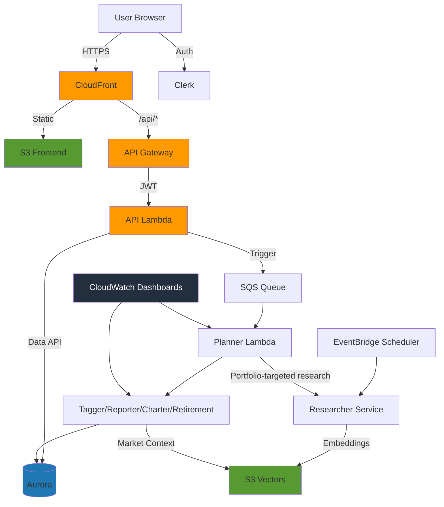

# Part 8: Enterprise Grade — Scalability, Security, Monitoring, Guardrails & Observability

Welcome to **Part 8** of the Alex Financial Advisor build-out. In this part, we take the system from “it works” to **production-ready** with enterprise-grade practices for:

- **Scalability** (serverless capacity, throttling, cost controls)
- **Security** (least privilege IAM, JWT auth, WAF/GuardDuty options)
- **Monitoring** (CloudWatch dashboards + alarms)
- **Guardrails** (input/output validation, retries, safe fallbacks)
- **Explainability** (rationale + auditability)
- **Observability** (LangFuse tracing across agents)

This README combines the original Part 8 narrative (from `guides/8_enterprise.md`) with **additional features we’ve since implemented** in the app and deployment tooling.


## REMINDER — Major Tip

There’s a file `gameplan.md` in the project root that describes the entire Alex project to an AI agent, so you can ask questions and get help. There’s also an identical `CLAUDE.md` and `AGENTS.md` file.

If you need help, start your favorite AI agent and give it this instruction:

> I am a student on the course AI in Production. We are in the course repo. Read the file `gameplan.md` for a briefing on the project. Read this file completely and read all the linked parts carefully. Do not start any work apart from reading and checking directory structure. When you have completed all reading, let me know if you have questions before we get started.

After answering questions, say exactly which part you’re on and any issues. Be careful to validate every suggestion; always ask for the root cause and evidence of problems.


## What This Part Builds (Current Branch)

### Infrastructure (Terraform)

- **CloudWatch dashboards** in `terraform/8_enterprise`:
  - `alex-ai-model-usage` (Bedrock invocation/errors/token usage/latency + SageMaker endpoint metrics)
  - `alex-agent-performance` (planner + agent Lambda duration/errors/invocations/concurrency/throttles)

### Application / Product Features (Added Since Original Part 8 Guide)

- **Data quality + freshness indicators** in the analysis UI:
  - missing prices / missing allocations
  - last-updated timestamps
  - “confidence” cues when defaults/heuristics are used
- **Scenario Planning (Instant)** widgets in the Retirement tab (editable assumptions + instant recompute)
- **Rebalance Settings (Instant)** widgets in the Rebalancing tab (instant recompute preview)
- **Tab-level PDF export** (“Export Tab PDF” via browser print-to-PDF)
- **Instrument Performance** page (Polygon-powered price series; coverage depends on Polygon plan)
- **Market Context via S3 Vectors**:
  - scheduled Researcher runs every ~2 hours (optional)
  - portfolio-targeted Researcher runs triggered after analyses (best-effort)

### Deployment Tooling Improvements

- `scripts/deploy_stacks.py` now:
  - auto-approves Terraform applies
  - loads `.env` automatically
  - after **DB deploy**, auto-propagates:
    - `AURORA_CLUSTER_ARN` / `AURORA_SECRET_ARN` into `./.env`
    - `aurora_cluster_arn` / `aurora_secret_arn` into `terraform/6_agents/terraform.tfvars`
  - `--core` runs DB testdata before agents


## Architecture (Enterprise View)




## Prerequisites

- Completed Parts 1–7 (or deploy everything with `scripts/deploy_stacks.py --all`)
- AWS CLI configured
- Terraform installed
- Python 3.12 + `uv`
- Node.js 20+ (for the frontend)


# Section 1: Scalability

Our serverless architecture is already designed for automatic scaling, but here’s how to configure it for enterprise-level traffic.

## Understanding Serverless Scalability

AWS scales these components automatically:

1. **Lambda**:
   - Default concurrent executions: 1,000 (can be increased)
   - Each agent can handle requests in parallel
2. **Aurora Serverless v2**:
   - Scales between min/max ACUs
   - Scales quickly based on load
3. **API Gateway**:
   - High throughput with configurable throttling limits
4. **SQS**:
   - High throughput buffering between API and agents

## Configuring for Higher Scale

### Aurora scaling (`terraform/5_database/main.tf`)

```hcl
resource "aws_rds_cluster" "aurora" {
  serverlessv2_scaling_configuration {
    max_capacity = 16
    min_capacity = 0.5
  }
}
```

### Lambda compute + reserved concurrency (`terraform/6_agents/main.tf`)

```hcl
resource "aws_lambda_function" "planner" {
  memory_size = 10240
  timeout     = 900

  # Optional: guaranteed headroom under load
  reserved_concurrent_executions = 100
}
```

### API Gateway throttling (`terraform/7_frontend/main.tf`)

```hcl
resource "aws_apigatewayv2_stage" "api" {
  default_route_settings {
    throttle_rate_limit  = 10000
    throttle_burst_limit = 5000
  }
}
```

## Load Testing

### macOS/Linux

```bash
apt-get install apache2-utils  # Ubuntu/Debian
brew install apache2-utils     # macOS

ab -n 1000 -c 50 -H "Authorization: Bearer YOUR_TOKEN" \
   https://your-api.execute-api.region.amazonaws.com/api/user
```

### Windows (simple option)

```powershell
$headers = @{"Authorization" = "Bearer YOUR_TOKEN"}
$url = "https://your-api.execute-api.region.amazonaws.com/api/user"

1..100 | ForEach-Object {
  Invoke-WebRequest -Uri $url -Headers $headers -Method GET
  Write-Host "Request $_ completed"
}
```

## Cost Optimization at Scale

- Use AWS Cost Explorer + budget alerts
- Prefer CloudFront caching for static assets
- Consider Step Functions for complex long orchestrations (if you outgrow single-Lambda orchestration)


# Section 2: Security

## Current Security Implementation

### 1) IAM least privilege

Each Lambda has minimal permissions. Example (conceptual):

```hcl
resource "aws_iam_role_policy" "planner_policy" {
  policy = jsonencode({
    Statement = [
      {
        Effect = "Allow"
        Action = ["rds-data:ExecuteStatement", "rds-data:BatchExecuteStatement"]
        Resource = "arn:aws:rds-db:*:*:cluster:alex-database"
      },
      {
        Effect = "Allow"
        Action = ["lambda:InvokeFunction"]
        Resource = [
          "arn:aws:lambda:*:*:function:alex-tagger",
          "arn:aws:lambda:*:*:function:alex-reporter",
          "arn:aws:lambda:*:*:function:alex-charter",
          "arn:aws:lambda:*:*:function:alex-retirement"
        ]
      }
    ]
  })
}
```

### 2) JWT authentication with Clerk

- All API calls require a valid JWT
- JWKS endpoint enables key rotation without code changes
- User context is validated per-request

### 3) API Gateway throttling (DoS cost protection)

```hcl
throttle_rate_limit  = 100
throttle_burst_limit = 200
```

### 4) CORS controls

- Restrict origins to your CloudFront domain
- Avoid wildcard origins when using credentials

### 5) XSS protection

Example CSP pattern (conceptual):

```html
<meta
  httpEquiv="Content-Security-Policy"
  content="default-src 'self'; script-src 'self' 'unsafe-inline' https://clerk.com; style-src 'self' 'unsafe-inline';"
/>
```

### 6) Secrets management

- Aurora credentials live in AWS Secrets Manager
- Never store DB credentials in code

## Additional Enterprise Security Features (Optional)

### 1) AWS WAF

Add to `terraform/7_frontend/main.tf` (conceptual):

```hcl
resource "aws_wafv2_web_acl" "api_protection" {
  name  = "alex-api-waf"
  scope = "REGIONAL"

  default_action { allow {} }

  rule {
    name     = "RateLimitRule"
    priority = 1
    statement {
      rate_based_statement {
        limit              = 2000
        aggregate_key_type = "IP"
      }
    }
    action { block {} }
  }

  rule {
    name     = "SQLiRule"
    priority = 2
    statement {
      managed_rule_group_statement {
        vendor_name = "AWS"
        name        = "AWSManagedRulesSQLiRuleSet"
      }
    }
    override_action { none {} }
  }
}
```

### 2) VPC endpoints (private AWS connectivity)

```hcl
resource "aws_vpc_endpoint" "s3" {
  vpc_id       = aws_vpc.main.id
  service_name = "com.amazonaws.region.s3"
}
```

### 3) GuardDuty (threat detection)

```hcl
resource "aws_guardduty_detector" "main" {
  enable                       = true
  finding_publishing_frequency = "FIFTEEN_MINUTES"
}
```

### 4) Parameter validation (example)

```python
from pydantic import BaseModel, validator
import re

class PositionCreate(BaseModel):
    symbol: str

    @validator("symbol")
    def validate_symbol(cls, v):
        if not re.match(r"^[A-Z]{1,10}$", v):
            raise ValueError("Invalid symbol format")
        return v
```


# Section 3: Monitoring

## Structured logging

Conceptual API example:

```python
import json
import logging
from datetime import datetime

logger = logging.getLogger()
logger.setLevel(logging.INFO)

class StructuredLogger:
    @staticmethod
    def log_event(event_type, user_id=None, details=None):
        logger.info(json.dumps({
            "timestamp": datetime.utcnow().isoformat(),
            "event_type": event_type,
            "user_id": user_id,
            "details": details,
        }))
```

Conceptual planner example:

```python
logger.info(json.dumps({
  "event": "PLANNER_STARTED",
  "job_id": job_id,
  "user_id": user_id,
  "timestamp": start_time.isoformat(),
}))
```

## Deploying the CloudWatch Dashboards (Part 8)

```bash
cd scripts
uv run deploy_stacks.py --enterprise
```

Or manually:

```bash
cd terraform/8_enterprise
terraform init
terraform apply
terraform output
```

## Alarms (recommended)

Set CloudWatch alarms for:

- Lambda Errors (sum over 5 minutes)
- Lambda Duration (p95/p99)
- Throttles
- SQS age / DLQ messages


# Section 4: Guardrails

Guardrails are “just code”: validation checks before/after model calls to make sure outputs are safe and usable.

## Charter output validation (conceptual)

```python
import json
import logging

logger = logging.getLogger()

def validate_chart_data(chart_json: str):
    data = json.loads(chart_json)
    if "charts" not in data or not isinstance(data["charts"], list):
        return False, "Missing or invalid charts field", {}
    return True, "", data
```

If invalid: return a safe fallback payload and surface an error banner in the UI.

## Input validation (prompt-injection defense)

```python
def sanitize_user_input(text: str) -> str:
    dangerous_patterns = [
        "ignore previous instructions",
        "disregard all prior",
        "forget everything",
        "new instructions:",
        "system:",
        "assistant:",
    ]

    lower = text.lower()
    for p in dangerous_patterns:
        if p in lower:
            return "[INVALID INPUT DETECTED]"
    return text
```

## Response size limits

```python
def truncate_response(text: str, max_length: int = 50000) -> str:
    if len(text) > max_length:
        return text[:max_length] + "\n\n[Response truncated]"
    return text
```

## Retry logic with exponential backoff

```python
from tenacity import retry, stop_after_attempt, wait_exponential, retry_if_exception_type

class AgentTemporaryError(Exception):
    pass

@retry(
    stop=stop_after_attempt(3),
    wait=wait_exponential(multiplier=1, min=2, max=10),
    retry=retry_if_exception_type((AgentTemporaryError, TimeoutError)),
)
async def invoke_agent_with_retry(...):
    ...
```


# Section 5: Explainability

## Rationale-first structured outputs

For example, in the Tagger agent you can include a `rationale` field *before* the final classifications so the model has to reason first (rather than post-hoc explaining).

Conceptual pattern:

```python
from pydantic import BaseModel, Field

class InstrumentClassification(BaseModel):
    rationale: str = Field(description="Why this classification was chosen")
    # ... classification fields ...
```

## Recommendation formatting

In the Reporter output, ensure each recommendation includes:

- Recommendation
- Reasoning
- Impact
- Priority

## Audit trail for compliance

Conceptual pattern:

```python
import hashlib
import json
from datetime import datetime

class AuditLogger:
    @staticmethod
    def log_ai_decision(agent_name, job_id, input_data, output_data, model_used, duration_ms):
        audit_entry = {
            "timestamp": datetime.utcnow().isoformat(),
            "agent": agent_name,
            "job_id": job_id,
            "model": model_used,
            "input_hash": hashlib.sha256(json.dumps(input_data, sort_keys=True).encode()).hexdigest(),
            "duration_ms": duration_ms,
        }
        print(json.dumps(audit_entry))
```

In the current app, “Assumptions & Audit” is surfaced directly in the analysis output for traceability.


# Section 6: Observability with LangFuse

LangFuse provides tracing for LLM applications: agent interactions, token usage, latency, and failures.

## Setup

1. Create an account: https://cloud.langfuse.com
2. Create a project and generate API keys
3. Add to `terraform/6_agents/terraform.tfvars`:

```hcl
langfuse_public_key = "pk-lf-xxxxxxxxxx"
langfuse_secret_key = "sk-lf-xxxxxxxxxx"
langfuse_host       = "https://cloud.langfuse.com"

# Required for trace export (even with Bedrock)
openai_api_key = "sk-xxxxxxxxxx"
```

## How the integration works (pattern)

Each agent can wrap execution in an observability context manager that:

- configures the trace exporter only if env vars are present
- flushes traces on exit (important for Lambda)

Conceptual usage:

```python
from observability import observe

def lambda_handler(event, context):
    with observe():
        ...
```

## View traces

- LangFuse dashboard: https://cloud.langfuse.com


# Deploying Part 8 (Recommended)

## One command: Researcher → Enterprise

```bash
cd scripts
uv run deploy_stacks.py --all
```

## Just dashboards

```bash
cd scripts
uv run deploy_stacks.py --enterprise
```


# Useful Docs

- `guides/8_enterprise.md` — original Part 8 narrative (concept + patterns)
- `scripts/README.md` — deploy/destroy tooling
- `guides/architecture.md` and `guides/agent_architecture.md` — system design
