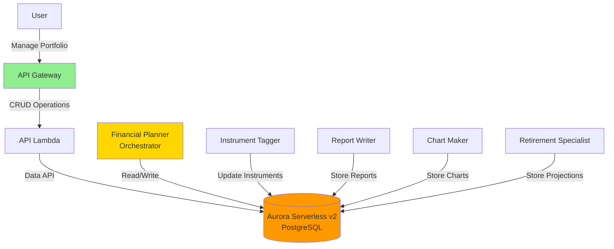
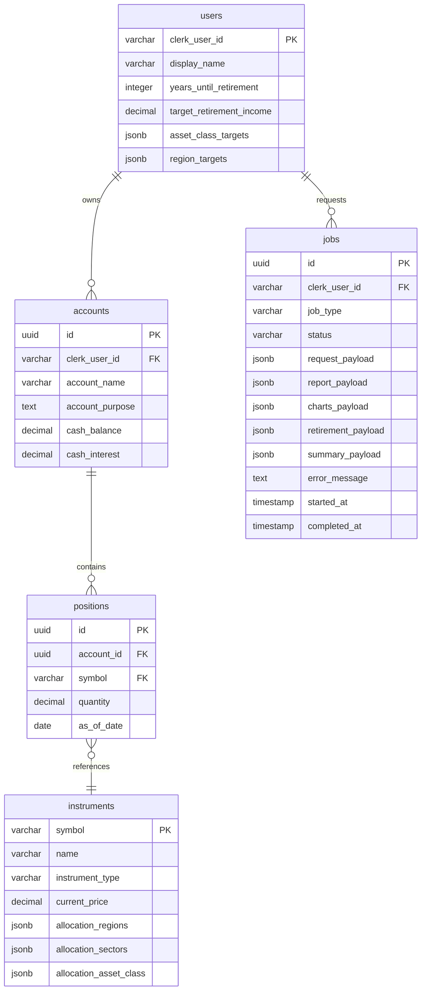

# 🧮 **Part 5 — Database & Shared Infrastructure**

In this branch, you give Alex a **proper backend brain**: a shared Aurora Serverless v2 PostgreSQL database, plus a reusable database layer that all agents (Planner, Tagger, Reporter, Retirement, etc.) will share.

By the end of this branch, Alex is no longer just a research toy – it has a **multi-agent, multi-user SaaS-style data model** with proper schema, validation, and scripts for seeding, resetting, and verifying the database.

## 🏦 **Why Aurora Serverless v2 with the Data API?**

AWS offers many database services. For Alex, we need:

* Strong relational modelling (users, accounts, positions, jobs)
* JSONB for flexible payloads (charts, reports, retirement projections)
* Minimal networking/VPC complexity
* Easy integration with Lambda and other serverless components

### Common AWS database options

| Service            | Type           | Best For                                | Why Not for Alex (here)                                     |
| ------------------ | -------------- | --------------------------------------- | ----------------------------------------------------------- |
| **DynamoDB**       | NoSQL          | Key-value lookups, very high-scale apps | No SQL joins; awkward for relational portfolio data         |
| **RDS (standard)** | SQL (managed)  | Predictable, always-on workloads        | Needs VPC + networking; always running → higher idle cost   |
| **DocumentDB**     | Document NoSQL | MongoDB-compatible apps                 | Overkill; poorer fit for strongly structured financial data |
| **Neptune**        | Graph          | Social / graph relationships            | Wrong model – we do not need graph queries                  |
| **Timestream**     | Time-series    | Metrics, IoT, telemetry                 | Too specialised; we need full relational + JSONB            |

### Why Aurora Serverless v2 PostgreSQL + Data API?

We use **Aurora Serverless v2 with the Data API** because it offers:

1. **No VPC hassle** – Data API gives HTTPS access; no private networking setup
2. **Scales to near-zero** – Low baseline cost for a learning project
3. **PostgreSQL** – Mature SQL with JSONB support for flexible payloads
4. **Serverless** – Auto-scales for spikes when agents run heavy workloads
5. **Data API** – Lambda-friendly; no persistent connections or pooling required
6. **Pay-per-use** – Good cost profile while you iterate on the system

You get a production-grade relational database without having to dive into VPCs, bastion hosts, or connection-pool tuning on day one.

## 🧱 **What This Branch Builds**

This branch deploys and wires up:

* ✅ Aurora Serverless v2 PostgreSQL cluster with the Data API enabled
* ✅ Core schema for users, accounts, positions, instruments, and jobs
* ✅ Shared database package (Pydantic-backed) for all backend agents
* ✅ Seed data: 22 popular ETFs with allocation breakdowns
* ✅ Reset + verification scripts for fast, repeatable local development

Architecture context:



# 🪜 **Step 0 — Add Required IAM Permissions**

Before Terraform can create Aurora, subnets, secrets, and Data API resources, your IAM user must have the right permissions.

### 0.1 Create a custom RDS + Data API policy

1. Sign in as the **root user** (only for IAM setup)
2. Go to **IAM → Policies → Create policy**
3. Switch to the **JSON** tab and paste:

```json
{
  "Version": "2012-10-17",
  "Statement": [
    {
      "Sid": "RDSPermissions",
      "Effect": "Allow",
      "Action": [
        "rds:CreateDBCluster",
        "rds:CreateDBInstance",
        "rds:CreateDBSubnetGroup",
        "rds:DeleteDBCluster",
        "rds:DeleteDBInstance",
        "rds:DeleteDBSubnetGroup",
        "rds:DescribeDBClusters",
        "rds:DescribeDBInstances",
        "rds:DescribeDBSubnetGroups",
        "rds:DescribeGlobalClusters",
        "rds:ModifyDBCluster",
        "rds:ModifyDBInstance",
        "rds:ModifyDBSubnetGroup",
        "rds:AddTagsToResource",
        "rds:ListTagsForResource",
        "rds:RemoveTagsFromResource",
        "rds-data:ExecuteStatement",
        "rds-data:BatchExecuteStatement",
        "rds-data:BeginTransaction",
        "rds-data:CommitTransaction",
        "rds-data:RollbackTransaction"
      ],
      "Resource": "*"
    },
    {
      "Sid": "EC2Permissions",
      "Effect": "Allow",
      "Action": [
        "ec2:DescribeVpcs",
        "ec2:DescribeVpcAttribute",
        "ec2:DescribeSubnets",
        "ec2:DescribeAvailabilityZones",
        "ec2:DescribeSecurityGroups",
        "ec2:CreateSecurityGroup",
        "ec2:DeleteSecurityGroup",
        "ec2:AuthorizeSecurityGroupIngress",
        "ec2:AuthorizeSecurityGroupEgress",
        "ec2:RevokeSecurityGroupIngress",
        "ec2:RevokeSecurityGroupEgress",
        "ec2:CreateTags",
        "ec2:DescribeTags"
      ],
      "Resource": "*"
    },
    {
      "Sid": "SecretsManagerPermissions",
      "Effect": "Allow",
      "Action": [
        "secretsmanager:CreateSecret",
        "secretsmanager:DeleteSecret",
        "secretsmanager:DescribeSecret",
        "secretsmanager:GetSecretValue",
        "secretsmanager:PutSecretValue",
        "secretsmanager:UpdateSecret"
      ],
      "Resource": "*"
    },
    {
      "Sid": "KMSPermissions",
      "Effect": "Allow",
      "Action": [
        "kms:CreateGrant",
        "kms:Decrypt",
        "kms:DescribeKey",
        "kms:Encrypt"
      ],
      "Resource": "*"
    }
  ]
}
```

4. Continue → name the policy **`AlexRDSCustomPolicy`**
5. Set a description, e.g. `RDS and Data API permissions for Alex project`
6. Create the policy

### 0.2 Attach policies to the `AlexAccess` group

1. In IAM, go to **User groups → AlexAccess**

2. Open the **Permissions** tab → **Add permissions → Attach policies**

3. Attach these AWS managed policies:

   * `AmazonRDSDataFullAccess`
   * `AWSLambda_FullAccess`
   * `AmazonSQSFullAccess`
   * `AmazonEventBridgeFullAccess`
   * `SecretsManagerReadWrite`

4. Also attach your custom policy:

   * `AlexRDSCustomPolicy`

5. Save changes

### 0.3 Verify from your IAM user

Sign out from root, sign back in as your **IAM user** (`aiengineer`), then run:

```bash
aws rds describe-db-clusters
```

This should return either an empty list or any existing clusters (no AccessDenied).

Check the Data API CLI is available:

```bash
aws rds-data execute-statement --help
```

You should see usage information mentioning required arguments like `--resource-arn`, `--secret-arn`, `--sql`.

# 🧱 **Step 1 — Deploy Aurora Serverless v2 with Terraform**

### 1.1 Configure Terraform variables

From the project root:

```bash
cd terraform/5_database
cp terraform.tfvars.example terraform.tfvars
```

Edit `terraform.tfvars`:

```hcl
aws_region   = "us-east-1"  # Your main region
min_capacity = 0.5          # Minimum ACUs (keep low for dev)
max_capacity = 1.0          # Maximum ACUs (small for dev)
```

### 1.2 Deploy the database

Mac / Linux:

```bash
terraform init
terraform apply
```

Windows PowerShell:

```powershell
terraform init
terraform apply
```

Confirm with `yes`.

Terraform will create:

* Aurora Serverless v2 cluster with the Data API enabled
* Subnet group, security group, and networking basics
* Secrets Manager entry for DB credentials
* Database **`alex`** inside the cluster

First-time provisioning typically takes **10–15 minutes**.

### 1.3 Save the outputs into `.env`

After Terraform completes:

```bash
terraform output
```

Note the values for:

* `aurora_cluster_arn`
* `aurora_secret_arn`

In the project root, open your `.env` file and add:

```text
# Part 5 - Database
AURORA_CLUSTER_ARN=arn:aws:rds:us-east-1:123456789012:cluster:alex-aurora-cluster
AURORA_SECRET_ARN=arn:aws:secretsmanager:us-east-1:123456789012:secret:alex-aurora-credentials-xxxxx
```

Use the exact values from your own Terraform output.

# 🔌 **Step 2 — Test the Data API Connection**

From the project root:

```bash
cd backend/database
uv run test_data_api.py
```

Expected output (or similar):

```text
✅ Successfully connected to Aurora using Data API!
Database version: PostgreSQL 15.x
```

If this works, your IAM, secrets, and Data API configuration are all correct.

# 🧬 **Step 3 — Run Database Migrations**

Create the schema (tables, indexes, triggers) via the Data API:

```bash
# From backend/database
uv run run_migrations.py
```

You should see a step-by-step log of each statement being executed, followed by a summary indicating success.

# 🌱 **Step 4 — Load Seed Data (ETFs)**

Populate the `instruments` table with 22 popular ETFs:

```bash
# From backend/database
uv run seed_data.py
```

Example output:

```text
Seeding 22 instruments...
✅ SPY - SPDR S&P 500 ETF
✅ QQQ - Invesco QQQ Trust
✅ BND - Vanguard Total Bond Market ETF
...
✅ Successfully seeded 22 instruments
```

# 🧪 **Step 5 — Create Test Data (Optional)**

For development, you can reset the database and create a fully-populated test user and portfolio:

```bash
# From backend/database
uv run reset_db.py --with-test-data
```

Typical output:

```text
Dropping existing tables...
Running migrations...
Loading default instruments...
Creating test user with portfolio...
✅ Database reset complete with test data!

Test user created:
- User ID: test_user_001
- Display Name: Test User
- 3 accounts (401k, Roth IRA, Taxable)
- 5 positions in 401k account
```

This is useful for quickly bootstrapping a realistic dataset.

# ✅ **Step 6 — Verify Database Integrity**

The verification script gives you a “pre-flight check” before wiring agents into the database.

```bash
# From backend/database
uv run verify_database.py
```

It reports:

* Table presence and row counts
* Instrument allocation sanity checks (e.g. percentages sum to 100)
* Indexes and triggers
* Overall status

Look for the final confirmation section indicating the database is ready for use in the next branch.

# 🧩 **Understanding the Database Schema**

The schema is deliberately compact but expressive enough for multi-agent workflows.



### Table roles

* **users**
  Minimal profile data; authentication is handled by Clerk. Includes retirement preferences and allocation targets.

* **instruments**
  Master list of ETFs/stocks/funds. Contains allocation JSONB fields used by the Tagger, Planner, and Reporter.

* **accounts**
  Logical investment accounts (401k, ISA, brokerage, etc.) per user.

* **positions**
  Holdings (symbol + quantity per account) with `as_of_date`.

* **jobs**
  Tracks asynchronous work across the system. Each agent writes into its own JSONB payload:

  * `request_payload` – original request (e.g. “Build a retirement plan”)
  * `report_payload` – Reporter’s markdown analysis
  * `charts_payload` – Charter’s chart specs
  * `retirement_payload` – Retirement agent’s projections
  * `summary_payload` – Planner’s final summary / metadata

All inserts/updates are validated via Pydantic schemas before hitting the database, helping maintain integrity across agents.

# 💸 **Cost Management**

Aurora Serverless v2 approximate costs:

* **0.5 ACU minimum capacity**: roughly **$40–45/month** if left running
* Actual daily cost depends on activity and scale

To keep costs under control:

```bash
cd terraform/5_database
terraform destroy
```

This:

* Stops all Aurora charges
* Deletes the cluster and all data

When you are ready to continue:

```bash
terraform apply
```

You can then re-run migrations and seed scripts to restore the baseline dataset.

> Only run `terraform destroy` when you’re comfortable losing all data in the cluster.

# 🛠️ **Troubleshooting**

### Data API connection issues

Check cluster status:

```bash
aws rds describe-db-clusters --db-cluster-identifier alex-aurora-cluster
```

Status should be `available`.

Check Data API is enabled:

```bash
aws rds describe-db-clusters \
  --db-cluster-identifier alex-aurora-cluster \
  --query 'DBClusters[0].EnableHttpEndpoint'
```

Should return `true`.

Check secrets:

```bash
aws secretsmanager list-secrets \
  --query "SecretList[?contains(Name, 'alex-aurora-credentials')].Name"
```

Then:

```bash
aws secretsmanager get-secret-value \
  --secret-id alex-aurora-credentials-XXXX \
  --query SecretString \
  --output text
```

This should contain username and password in JSON form.

### Migration failures

From `backend/database`:

* Inspect the migration definitions (in this project they’re embedded in Python; for any SQL file based migrations, inspect the relevant file).

To reset and retry:

```bash
uv run reset_db.py
```

This drops tables, re-runs migrations, and reloads seed data.

### Pydantic validation errors

Typical causes:

* Allocation dictionaries not summing to exactly `100.0`
* Invalid enum / literal values for regions, sectors, or asset classes

Review schema definitions:

```bash
# From backend/database
cat src/schemas.py
```

Check that your custom data respects the expected value ranges and formats.

# 📍 **Next Steps**

With this branch complete, you now have:

* Aurora Serverless v2 PostgreSQL with the Data API enabled
* A clean, validated schema for users, portfolios, instruments, and jobs
* Seeded ETF data and optional test user portfolios
* A shared database package ready to be used by all backend agents
