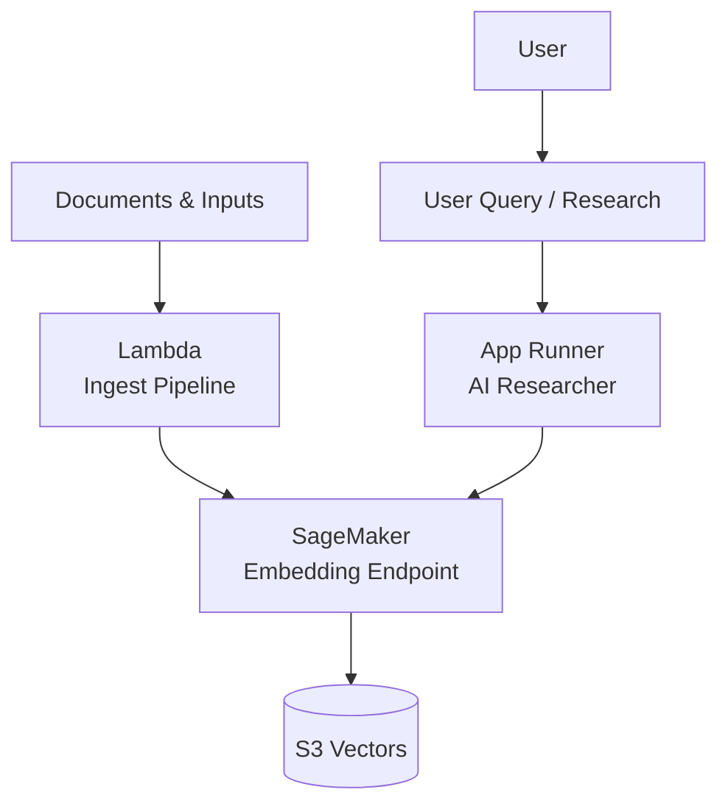

# 🧩 **Part 2 — SageMaker Serverless Deployment**

This branch deploys the **SageMaker Embedding Endpoint** used throughout Project Alex.
The endpoint is responsible for converting raw text into **vector embeddings**, forming the foundation for:

* Document ingestion
* Semantic search
* Portfolio analysis
* Research insights
* Question–answering workflows

This deployment uses **SageMaker Serverless**, allowing industry-grade scalability while keeping operational costs minimal.

This branch builds directly upon the IAM configuration completed in Part 1.

## 🧠 **What This Branch Provides**

By completing this branch, you will have:

* A fully deployed **HuggingFace-based embedding model** in SageMaker
* A **serverless** endpoint that scales automatically
* Terraform-managed infrastructure for reproducibility
* A working embedding test flow via AWS CLI (Linux/macOS and Windows)
* Clear troubleshooting steps and validation commands

This component becomes the core “vector engine” consumed by later branches, including ingestion, tagging, research, and chart generation agents.

## 🏗️ **Architecture Overview**

The embedding component fits into the full Alex architecture as follows:



The model used is `sentence-transformers/all-MiniLM-L6-v2`, automatically loaded by SageMaker’s HuggingFace container.

## 🌿 **About This Branch**

This branch focuses specifically on:

* Creating the SageMaker model configuration
* Configuring the serverless inference endpoint
* Managing IAM role assignment for SageMaker (via Terraform)
* Testing the endpoint with a real embedding request
* Providing OS-specific invoke commands (Linux/macOS + Windows)

No model packaging is required — SageMaker automatically downloads the model from HuggingFace.

## 📦 **Prerequisites**

Before starting, ensure you have:

* IAM configuration from **Part 1** completed
* Terraform **1.5+** installed
* AWS CLI configured for your IAM user
* `.env` file created with

  ```
  AWS_ACCOUNT_ID=xxxx
  DEFAULT_AWS_REGION=us-east-1
  ```

# 🪜 **Step 1 — Configure Terraform for SageMaker**

### **1.1 Navigate to the correct directory**

```bash
cd terraform/2_sagemaker
```

### **1.2 Create your variables file**

```bash
cp terraform.tfvars.example terraform.tfvars
```

Then edit `terraform.tfvars`:

```hcl
aws_region = "us-east-1"
```

This value **must** match `DEFAULT_AWS_REGION` in your `.env` file.

# 🛠️ **Step 2 — Deploy the SageMaker Endpoint**

### **2.1 Initialise Terraform**

```bash
terraform init
```

### **2.2 Deploy**

```bash
terraform apply
```

Confirm with `yes` when prompted.

Terraform will create:

* SageMaker execution IAM role
* SageMaker model referencing the HuggingFace container
* Serverless endpoint (`alex-embedding-endpoint`)
* Appropriate IAM propagation delays to avoid SageMaker race conditions

Once complete, Terraform will output the endpoint name and ARN.

# 🗂️ **Step 3 — Save Your Configuration**

From Terraform outputs, note the endpoint name:

```
alex-embedding-endpoint
```

Add it to your `.env` file:

```
SAGEMAKER_ENDPOINT=alex-embedding-endpoint
```

You may also review outputs at any time:

```bash
terraform output
```

# 🔍 **Step 4 — Test the Embedding Endpoint**

Testing is performed using `vectorize_me.json` in the backend directory.

### **4.1 Navigate to backend folder**

```bash
cd ../../backend
```

### **4.2 Linux and macOS Invocation**

```bash
aws sagemaker-runtime invoke-endpoint \
  --endpoint-name alex-embedding-endpoint \
  --content-type application/json \
  --body fileb://vectorize_me.json \
  --output json \
  /dev/stdout
```

### **4.3 Windows PowerShell Invocation (Correct Method)**

Because PowerShell does not support `/dev/stdout`, you must use an output file:

```powershell
aws sagemaker-runtime invoke-endpoint `
  --region us-east-1 `
  --endpoint-name alex-embedding-endpoint `
  --content-type application/json `
  --body fileb://vectorize_me.json `
  output.json
```

View the results:

```powershell
Get-Content .\output.json
```

A successful response shows a JSON array of **384 floating-point values**, representing the embedding.

# 🧪 **Step 5 — Validate Deployment**

### Check endpoint status

```bash
aws sagemaker describe-endpoint --endpoint-name alex-embedding-endpoint --region us-east-1
```

Expected:

```
"EndpointStatus": "InService"
```

### View CloudWatch logs

```bash
aws logs tail /aws/sagemaker/Endpoints/alex-embedding-endpoint --follow --region us-east-1
```

### Verify model configuration

```bash
aws sagemaker describe-model \
  --model-name alex-embedding-model \
  --query 'PrimaryContainer.Environment' \
  --region us-east-1
```

Expected environment variables:

```
HF_MODEL_ID = sentence-transformers/all-MiniLM-L6-v2
HF_TASK = feature-extraction
```

# 🧹 **Troubleshooting**

### **Endpoint Not Found**

Cause: AWS CLI using the wrong region.
Solution: Add `--region us-east-1` or update:

```powershell
aws configure set region us-east-1
```

### **Endpoint Already Exists**

If Terraform was interrupted:

Import existing endpoint:

```bash
terraform import aws_sagemaker_endpoint.embedding_endpoint alex-embedding-endpoint
terraform apply
```

Or delete and recreate:

```bash
aws sagemaker delete-endpoint --endpoint-name alex-embedding-endpoint --region us-east-1
terraform apply
```

### **IAM Role Propagation Errors**

If endpoint creation fails on the first apply:

1. `terraform destroy`
2. Wait 30 seconds
3. `terraform apply`

SageMaker requires propagation delay before role reuse.

# 🚀 **Next Steps**

With the embedding endpoint now deployed, the next branch will:

* Create **S3 Vector Storage**
* Build the **Ingestion Lambda**
* Connect Lambda → SageMaker → S3 Vectors using Terraform
* Begin populating Alex’s knowledge base

Your embedding engine is now live and ready for integration into the wider Alex system.