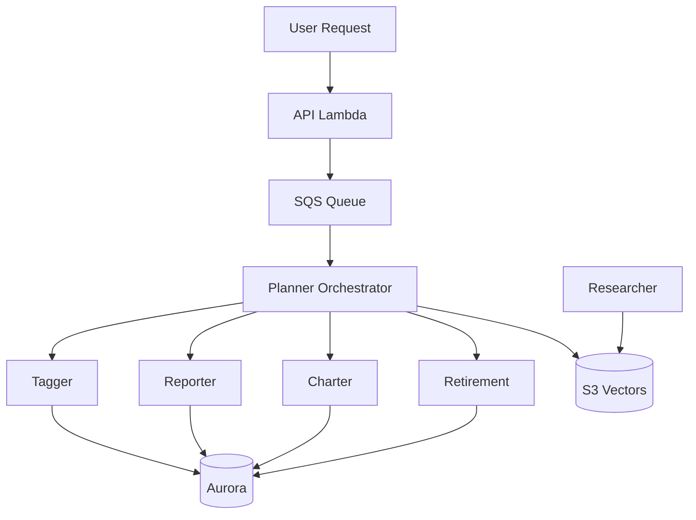

# Alex Financial Planner (LLMOps on AWS)

Terraform-first, multi-agent financial planning platform that pairs a Next.js frontend with serverless AI services on AWS.

```mermaid
flowchart LR
    U[User] --> CF[CloudFront]
    CF --> S3[S3 Static Site (Next.js)]
    CF -->|/api/*| APIGW[API Gateway]
    APIGW --> API[FastAPI Lambda]
    API --> SQS[SQS Queue]
    SQS --> Planner[Planner Lambda]
    Planner --> Agents[Tagger / Reporter / Charter / Retirement]
    Agents --> DB[(Aurora Serverless v2)]
    Planner --> Vectors[(S3 Vectors)]
    Ingest[Ingest Lambda] --> SageMaker[SageMaker Embeddings]
    Ingest --> Vectors
    Researcher[App Runner Researcher] --> Vectors
    EventBridge[EventBridge Scheduler] --> Researcher
    Bedrock[AWS Bedrock LLMs] --> Planner
    Bedrock --> Researcher
```

## Quick Start
1) Install prerequisites:
   - AWS CLI
   - Terraform >= 1.5
   - Python 3.12 + `uv`
   - Node.js 20+
   - Docker (for Lambda packaging)

2) Configure AWS:
```powershell
aws configure
aws sts get-caller-identity
```

3) Configure project inputs:
   - Create `.env` at repo root and `frontend/.env.local` (see guides).
   - Copy `terraform/*/terraform.tfvars.example` to `terraform.tfvars` in each module you deploy.

4) Deploy stacks (Parts 4-8):
```powershell
cd scripts
uv run deploy_stacks.py --all
```
Note: Parts 2-3 (embeddings and ingestion) are deployed by running Terraform in `terraform/2_sagemaker` and `terraform/3_ingestion`.

5) Run locally (optional):
```powershell
cd scripts
uv run run_local.py
```

For the full step-by-step path, follow `guides/1_permissions.md` through `guides/8_enterprise.md`.

## Architecture Overview
The platform is split into a public web app, a serverless API, and a multi-agent analysis pipeline backed by AWS storage and AI services.

## Agent Orchestration


## Tech Stack
- Frontend: Next.js (Pages Router), React, TypeScript, Tailwind CSS, Clerk authentication
- Backend: Python 3.12, FastAPI on Lambda, OpenAI Agents SDK, LiteLLM, SQS orchestration
- AI/ML: AWS Bedrock (LLM inference), SageMaker Serverless embeddings
- Data and storage: Aurora Serverless v2 PostgreSQL (Data API), S3 Vectors, S3 static hosting
- Platform: API Gateway, CloudFront, App Runner (Researcher), EventBridge Scheduler, CloudWatch, Langfuse

## Project Structure
- `guides/`: step-by-step deployment guides and architecture docs
- `terraform/`: independent IaC stacks for each subsystem
- `backend/`: agents, API, ingestion, database, researcher, scheduler
- `frontend/`: Next.js app and UI components
- `scripts/`: deploy, destroy, and local dev tooling
- `assets/`: static docs assets

## Guides
1) `guides/1_permissions.md` - IAM and AWS CLI setup
2) `guides/2_sagemaker.md` - SageMaker embeddings endpoint
3) `guides/3_ingest.md` - ingestion Lambda and S3 Vectors
4) `guides/4_researcher.md` - App Runner researcher service
5) `guides/5_database.md` - Aurora Serverless v2 + migrations
6) `guides/6_agents.md` - Planner and agent Lambdas
7) `guides/7_frontend.md` - Next.js frontend + API
8) `guides/8_enterprise.md` - monitoring, security, and observability

## Deploy/Destroy Options
Deploy (Parts 4-8):
```powershell
cd scripts
uv run deploy_stacks.py --research
uv run deploy_stacks.py --db
uv run deploy_stacks.py --agents
uv run deploy_stacks.py --frontend
uv run deploy_stacks.py --enterprise
uv run deploy_stacks.py --core
uv run deploy_stacks.py --all
```

Destroy (Parts 4-8):
```powershell
cd scripts
uv run destroy_stacks.py --research
uv run destroy_stacks.py --db
uv run destroy_stacks.py --core
uv run destroy_stacks.py --all
```

For direct Terraform use, run `terraform init` and `terraform apply` inside each `terraform/*` directory.

## Docs
- `guides/architecture.md` - system architecture and S3 Vectors flow
- `guides/agent_architecture.md` - multi-agent collaboration details
- `scripts/README.md` - deploy and local dev scripts
- `backend/README.md` - backend module overview
- `frontend/README.md` - frontend module overview
