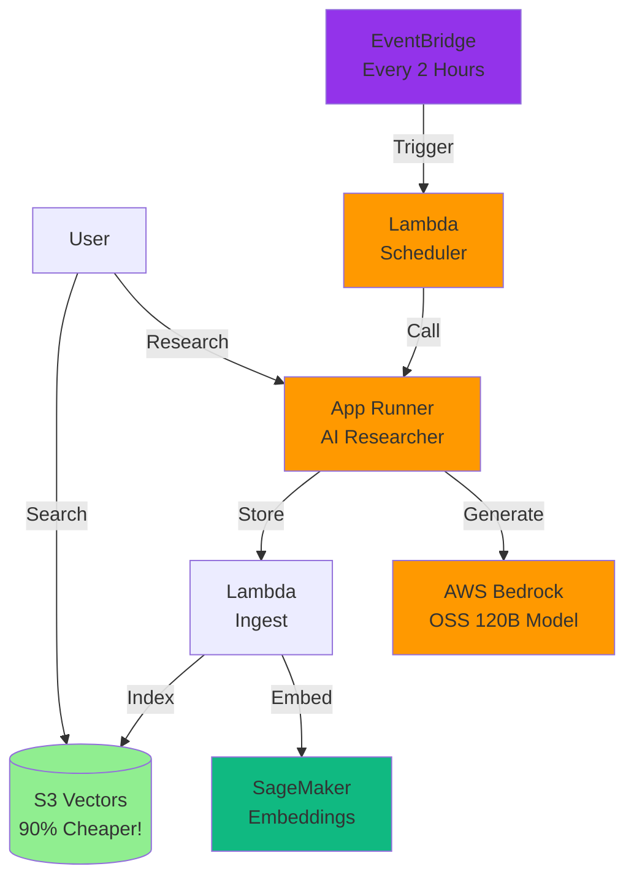

# 🛡️ **Part 1 — AWS Permissions Setup**

Welcome to **Project Alex — the Agentic Learning Equities eXplainer!**

This branch configures the foundational **AWS IAM permissions** required for the Alex system. Before deploying AI agents, embeddings, ingestion pipelines, or App Runner services, we must ensure that our IAM user has the correct, minimal, and secure permissions.

Alex is an AI-powered personal financial planner designed to help users:

* Understand their investment portfolios
* Plan for retirement
* Receive personalised financial guidance
* Track market opportunities and market trends

This branch prepares all IAM access needed across the lifecycle of the project.


## 🧠 **What Is Alex?**

Alex is a fully agentic system built on AWS that performs:

* AI research and market analysis
* Document ingestion and embedding
* Portfolio understanding and tagging
* Retirement forecasting
* Interactive Q&A with financial logic

Each later branch builds a core subsystem of Alex. Permissions created in *this* branch allow those subsystems to function safely.


## 🏗️ **Architecture Overview**

Below is the high-level system architecture that will evolve across all guides:



See **architecture.md** for a full technical breakdown.


## 🌿 **About This Branch**

This branch focuses solely on:

* Creating a dedicated IAM group for Alex
* Adding the correct AWS-managed policies
* Adding a custom policy for the new **S3 Vectors** service
* Ensuring your IAM user (`aiengineer`) inherits these capabilities
* Confirming successful setup through AWS CLI tests

These permissions will support the upcoming components, including SageMaker embeddings, Bedrock calls, Lambda execution, and EventBridge-based scheduling.


## 📦 **Prerequisites**

Before starting, ensure you have:

* An AWS account with **root user** access
* **AWS CLI** installed and configured
* Your **IAM user** (`aiengineer`) already created
* **Terraform** version 1.5+
* Basic AWS familiarity


# 🪪 **Step 1 — Setting Up IAM Permissions**

### **1.1 Sign in as the Root User**

1. Visit: [https://aws.amazon.com/console](https://aws.amazon.com/console)
2. Choose **Root user**
3. Enter your email + password
4. Proceed to the console

⚠️ *Root access is used only for IAM setup. All future operations must be done using your IAM user.*


### **1.2 Create the S3 Vectors Permission Policy**

S3 Vectors is a new 2025-era AWS service, so we must manually create a policy:

1. Open **IAM → Policies**
2. Click **Create policy**
3. Switch to the **JSON** tab
4. Paste the following:

```json
{
    "Version": "2012-10-17",
    "Statement": [
        {
            "Effect": "Allow",
            "Action": [
                "s3vectors:*"
            ],
            "Resource": "*"
        }
    ]
}
```

5. Continue → Name it **AlexS3VectorsAccess**
6. Add description: *Full access to S3 Vectors for Alex project*
7. Create the policy


### **1.3 Create the `AlexAccess` IAM Group**

1. Navigate to **IAM → User groups**
2. Click **Create group**
3. Name it: `AlexAccess`
4. Attach these policies:

| Required Policy                | Purpose                            |
| ------------------------------ | ---------------------------------- |
| **AmazonSageMakerFullAccess**  | For embedding endpoints            |
| **AmazonBedrockFullAccess**    | For LLM inference                  |
| **CloudWatchEventsFullAccess** | Required for EventBridge scheduler |
| **AlexS3VectorsAccess**        | Custom S3 Vectors integration      |

Other permissions (Lambda, S3, CloudWatch, API Gateway) come from earlier global groups.

5. Create the group


### **1.4 Add the Group to Your IAM User**

1. Go to **IAM → Users**
2. Select your user: **`aiengineer`**
3. Open **Groups** tab
4. Click **Add user to groups**
5. Select **AlexAccess**
6. Save


### **1.5 Sign Out and Back In**

Sign out from root, then sign back in using:

* Account ID or alias
* Username: `aiengineer`
* Your IAM password

This refreshes policy evaluation.


### **1.6 Verify Permissions via AWS CLI**

Run:

```bash
aws sts get-caller-identity
```

You should see an IAM user ARN.

Then test SageMaker access:

```bash
aws sagemaker list-endpoints
```

If the result is empty **but not an error**, permissions are correct.


# 🧰 **Step 3 — Initial Project Setup**

### **Create Your `.env` File**

In the project root:

```bash
cd alex
aws sts get-caller-identity --query Account --output text
```

Create `.env`:

```text
AWS_ACCOUNT_ID=123456789012
DEFAULT_AWS_REGION=us-east-1
```

More entries will be added in later branches.


## 🚀 **Next Steps**

You now have:

* Root-level IAM configuration complete
* Custom S3 Vectors policy created
* AlexAccess group assigned
* IAM user access verified
* Your environment file initialised

Continue to the next branch:
👉 **AWS SageMaker — Serverless Embeddings Endpoint**

This will power Alex’s ability to understand text, documents, financial statements, and research inputs.